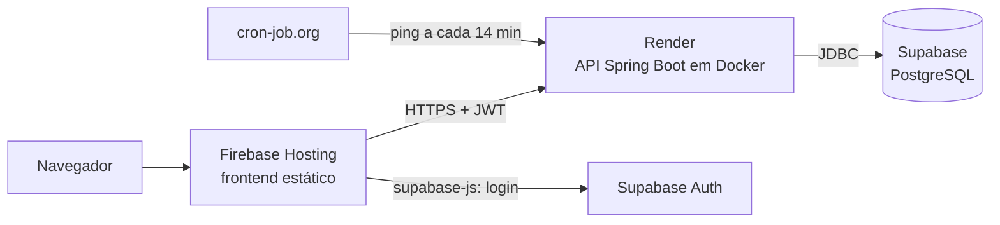

# Deploy

Único ambiente: **produção**. A branch `homologacao` é etapa de revisão no git, sem ambiente publicado.



| Peça | Serviço | Plano | Região | Cartão |
|---|---|---|---|---|
| Frontend | Firebase Hosting | Spark (grátis) | global (CDN) | não |
| Backend | Render, web service Docker | Free (0,1 CPU, 512 MB) | Oregon (US West) | não |
| Banco e login | Supabase | Free | `us-east-1` | não |
| Ping | cron-job.org | grátis | — | não |

**Região:** Render em Oregon e Supabase em Virgínia. Cada consulta ao banco leva cerca de 70 ms a mais. A região de um serviço do Render não muda depois de criado; aceito enquanto só houver dados fictícios.

---

## 1. Backend no Render

O serviço usa `backend/Dockerfile` (Java 25, JVM limitada para 512 MB). `render.yaml` na raiz descreve o mesmo serviço para um Blueprint.

| Campo | Valor |
|---|---|
| Language | Docker |
| Branch | `main` |
| Root Directory | `backend` |
| Instance Type | Free |
| Health Check Path | `/actuator/health/liveness` (não toca no banco) |
| Auto-Deploy | After CI Checks Pass |
| Build/Start Command | vazios (vale o `Dockerfile`) |

### Variáveis de ambiente (painel do Render; nunca no repositório)

| Variável | Valor |
|---|---|
| `DB_URL` | JDBC do *Session pooler* do Supabase, com `?sslmode=require` |
| `DB_USERNAME` | `postgres.<project-ref>` |
| `DB_PASSWORD` | senha do banco |
| `SUPABASE_URL` | `https://<project-ref>.supabase.co` |
| `CORS_ALLOWED_ORIGINS` | origens do frontend, separadas por vírgula (seção 3) |
| `SWAGGER_ENABLED` | **não definir** em produção (Swagger desligado) |

### Comportamento do plano grátis

- Dorme após 15 min sem requisição. Com 0,1 CPU, a API leva **cerca de 3 min** para voltar. O mesmo vale depois de cada deploy.
- 750 horas por mês por workspace. Um serviço ligado 24 h gasta cerca de 744; dormindo à noite, cerca de 465.
- Um ping mantém a API acordada (seção 2).

## 2. Ping no cron-job.org

| Campo | Valor |
|---|---|
| URL | `https://<serviço>.onrender.com/actuator/health` (consulta o banco, o que também evita a pausa do Supabase grátis) |
| Método | GET |
| Fuso | America/Sao_Paulo |
| Agenda (crontab) | `*/14 7-21 * * *` (a cada 14 min, das 7h00 às 21h56) |
| Notificação de falha | só após 3 falhas seguidas |

Intervalo de 14 min, não 15: o Render dorme aos 15 min. Das 22h às 7h a API dorme; o ping das 7h00 acorda, e ela fica pronta por volta das 7h03. Esse primeiro ping costuma dar timeout, e isso é esperado.

## 3. Frontend no Firebase Hosting

`firebase.json` (raiz) publica `frontend/dist`, devolve `index.html` para toda rota (SPA) e define os cabeçalhos de segurança (CSP, HSTS, `nosniff`). O `predeploy` roda `npm run build`.

### Primeira vez

1. Console do Firebase › projeto › **Hosting** › **Vamos começar**. Isso cria o site (endereço `<site>.web.app`).
2. Instalar a CLI e entrar: `npm install -g firebase-tools` e `firebase login`.
3. Na raiz do repositório: `firebase use --add`, escolher o projeto e o alias `default`. O comando cria `.firebaserc` (ID do projeto, não é segredo; pode ir no commit).
4. Criar `frontend/.env.production.local` (ignorado pelo git, nunca no commit):
   ```
   VITE_API_URL=https://<serviço>.onrender.com
   VITE_SUPABASE_URL=https://<project-ref>.supabase.co
   VITE_SUPABASE_PUBLISHABLE_KEY=sb_publishable_...
   ```
5. `firebase deploy --only hosting`.

### Depois do primeiro deploy (nesta ordem)

| Onde | O quê |
|---|---|
| Render › Environment | `CORS_ALLOWED_ORIGINS` = `https://<site>.web.app,https://<site>.firebaseapp.com`; salvar (o Render reinicia) |
| `firebase.json` | se a URL do Render mudar, ajustar o `connect-src` da CSP |
| Supabase › Authentication › URL Configuration | **Site URL** = `https://<site>.web.app`; **Redirect URLs** = `http://localhost:5173/**`, `https://<site>.web.app/**`, `https://<site>.firebaseapp.com/**`. Nunca `*` |
| Google Cloud › OAuth › Origens JavaScript | `http://localhost:5173`, `https://<site>.web.app`. A URI de redirecionamento não muda (callback do Supabase) |

### CSP: quando mudar

A política é estrita (`script-src 'self'`, sem inline). Mudanças esperadas:

- **CAPTCHA (Cloudflare Turnstile):** acrescentar `https://challenges.cloudflare.com` em `script-src` e criar `frame-src` para o mesmo endereço.
- **Biblioteca de UI que injete `<style>`** (Radix, por exemplo): se o console do navegador acusar bloqueio, ajustar `style-src`.

## 4. Conferência depois do deploy

```
GET  https://<serviço>.onrender.com/actuator/health          200
GET  https://<serviço>.onrender.com/api/v1/usuarios/me       401 (sem token)
GET  https://<serviço>.onrender.com/v3/api-docs              404 (Swagger desligado)
GET  https://<site>.web.app/qualquer/rota                    200 (SPA)
```

No navegador, em `https://<site>.web.app`: o console não deve mostrar erro de CORS nem de CSP.

## 5. Pendências de deploy

| Item | Observação |
|---|---|
| Domínio próprio | Melhora entrega do e-mail (DKIM, SPF, DMARC) e o endereço do site |
| Deploy automático do frontend | Hoje manual (`firebase deploy`). Candidato a GitHub Actions |
| Região do banco | Antes de dado real: Supabase em `sa-east-1` (SEGURANCA.md, seção 9) |
| Tempo de subida (3 min) | Pode cair com cache de classes da JVM (AppCDS), em card próprio |
