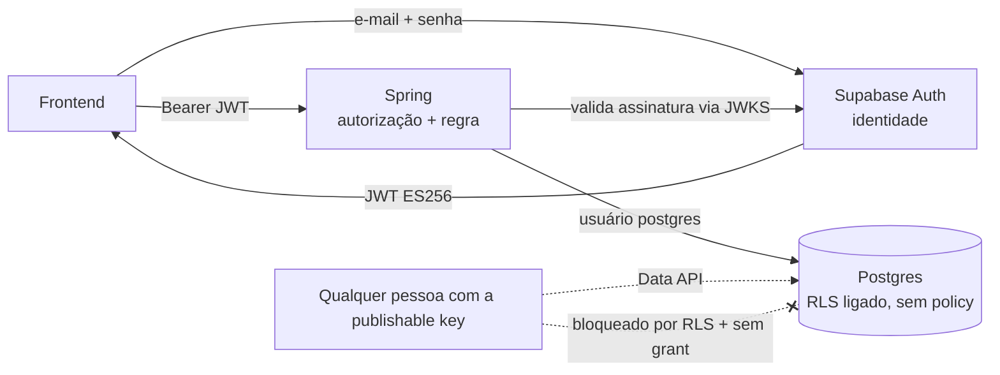

# Política de segurança

Vale para `backend/` e `frontend/`. Toda mudança que mexe em autenticação, autorização, dados de paciente ou upload passa por esta lista no PR.

O sistema guarda **dado de saúde**, que a LGPD trata como **dado sensível** (art. 5º, II e art. 11). Por isso: **até as políticas de LGPD da seção 9 estarem aprovadas, só dados fictícios.**

---

## 1. Modelo: quem faz o quê

| Camada | Responsável | Decide |
|---|---|---|
| Identidade | Supabase Auth | Quem é a pessoa (cadastro, login, e-mail, senha, MFA) |
| Autorização | Spring | O que a pessoa pode fazer (perfil, posse do paciente) |
| Dados | Postgres | Última barreira: nada entra por fora do Spring |

**Regra de ouro:** o frontend usa o Supabase **só** em `supabase.auth.*`. Nunca `supabase.from(...)`, `rpc`, `storage` ou `realtime`.

---

## 2. Banco (Supabase Postgres)

Estado conferido em 2026-10-03 pelo MCP do Supabase:

| Item | Estado |
|---|---|
| Event trigger `ensure_rls` → `public.rls_auto_enable()` | Ativo: liga RLS em toda tabela nova do `public` |
| Grants de `anon`/`authenticated` em `flyway_schema_history` | Nenhum |
| Usuário do backend `postgres` | `rolbypassrls = true` |
| Chaves JWT | ES256 assimétricas (JWKS publicado) |

Políticas:

1. **RLS ligado em toda tabela, sem policy.** `anon` e `authenticated` não leem nem escrevem nada. O backend conecta como `postgres`, que ignora RLS. Não criar policy: policy significa abrir acesso pela Data API, que não usamos.
2. **Sem grant para `anon` e `authenticated`.** Aplicado em `backend/src/main/resources/db/migration/V1__seguranca_base.sql`. Revoga tabelas, sequências e funções de `anon` e `authenticated`, inclusive para objetos futuros (`alter default privileges`).
   Isso também resolve os avisos do Security Advisor sobre `rls_auto_enable` executável por `anon`/`authenticated`.
3. **Data API desligada** em *Project Settings › Data API*. É a terceira barreira: mesmo com erro de grant, a API REST não existe.
4. **Schema só por migration Flyway.** Nada pelo painel. O MCP do Supabase fica em `read_only=true`.
5. **Rodar o Security Advisor** (*Advisors › Security*) depois de toda migration. Aviso `WARN` ou `ERROR` bloqueia o merge. `rls_enabled_no_policy` (`INFO`) é esperado e aceito.
6. **Backups:** o plano gratuito não tem PITR. Antes de dado real, definir plano com backup diário e teste de restauração.
7. **Pendente antes de dado real:** trocar o usuário `postgres` por um papel próprio da aplicação, só com `select/insert/update/delete` nas tabelas do sistema. O Flyway continua com `postgres`.

---

## 3. Autenticação (Supabase Auth)

Configurar em *Authentication*:

| Configuração | Valor |
|---|---|
| Confirmar e-mail | **Ligado** |
| Senha mínima | 10 caracteres, com letras e números |
| Proteção contra senha vazada | Ligar quando o plano permitir |
| Site URL | URL do frontend em produção |
| Redirect URLs | Só `http://localhost:5173/**` e as URLs do site (`https://fisiotech-3b4ad.web.app/**` e `https://fisiotech-3b4ad.firebaseapp.com/**`). Nunca `*` |
| SMTP | Gmail do projeto com senha de app (sem domínio próprio, pode cair em spam). Antes de abrir para a turma: domínio próprio autenticado (DKIM, SPF, DMARC). Templates e avisos de segurança em [supabase/README.md](supabase/README.md) |
| Rotação de refresh token | Ligada (padrão) |
| Expiração do access token | 3600 s (padrão) |
| Provedores sociais | Só Google. "Allow users without an email" e "Skip nonce checks" desligados |
| Login anônimo | Desligado |
| MFA (TOTP) | Habilitado. **Obrigatório para PROFISSIONAL** antes de dado real |

Regras:

- **Perfil nunca no `user_metadata`.** O próprio usuário altera esse campo com `supabase.auth.updateUser()`. Perfil fica em `usuario.perfil`, que só o Spring altera.
- "Esqueci a senha" responde a mesma mensagem exista ou não a conta (o Supabase já faz assim; a tela não pode quebrar isso).
- Registro profissional digitado não gera selo de "verificado".
- Exclusão de conta: o Spring apaga os dados próprios e chama a Admin API do Supabase para apagar o `auth.users`. Só nesse ponto o backend usa a `service_role` key.

---

## 4. Backend (Spring)

### Validação do token

- `spring-boot-starter-oauth2-resource-server`.
- `issuer-uri: https://<ref>.supabase.co/auth/v1` e `jwk-set-uri: https://<ref>.supabase.co/auth/v1/.well-known/jwks.json`.
- Conferir `iss`, `exp`, assinatura ES256 e `aud = authenticated`.
- Nunca aceitar `alg: none` nem HS256 com segredo compartilhado.

### Autorização

1. **Negar por padrão.** `anyRequest().authenticated()`. Endpoint público só com liberação explícita na `SecurityConfig`.
2. **Perfil vem do banco**, pelo `sub` do token. Usuário com token válido e sem linha em `usuario` só acessa `POST /api/v1/usuarios/me` (completar cadastro).
3. `@PreAuthorize("hasRole('PROFISSIONAL')")` em todo endpoint de paciente, avaliação e sessão. `ESTUDANTE` recebe **403**.
4. **Posse:** toda consulta a paciente passa por `PacienteService.buscarDoResponsavel`. Paciente de outro profissional: **404**, nunca 403.
5. **Sem IDOR:** id da URL nunca é confiado sozinho. A consulta sempre filtra pelo responsável (`findByIdAndResponsavelId`).
6. Autor não aprova o próprio material (regra no Service, com teste).
7. Com MFA obrigatório: endpoints de paciente exigem `aal = aal2` no token.

### Entrada e saída

- `@Valid` em todo DTO, com `@Size` em todo texto. Sem campo livre sem limite.
- Entidade nunca sai como JSON. Sempre DTO.
- Erro sai como `ProblemDetail`, sem stack trace e sem mensagem de SQL.
- Upload (`Anexo`): só PDF, PNG e JPEG; até 10 MB (`spring.servlet.multipart.max-file-size=10MB`); conferir o tipo pelos primeiros bytes do arquivo, não pela extensão; nome do arquivo gerado pelo servidor.
- Arquivos em bucket **privado** do Supabase Storage, acessado só pelo backend. Download por URL assinada de curta duração (5 min).
- Texto rico (`Conteudo.corpo`) é sanitizado no backend antes de salvar.

### Logs e auditoria

- **Nunca logar** token, senha, corpo de requisição de paciente, avaliação ou sessão.
- O Hibernate 7 loga a URL JDBC com a senha (`HHH10001005`). O `application.yml` sobe `org.hibernate.orm.connections.pooling` para `WARN`. Não remover; ao trocar versão, conferir o log de inicialização.
- Log de acesso guarda: id do usuário, rota, status, horário.
- `Paciente`, `Avaliacao` e `Sessao` com Hibernate Envers (`@Audited`): quem, quando, o quê.

### Rede

- CORS só para as origens de `CORS_ALLOWED_ORIGINS`. Nunca `*`.
- **Swagger desligado por padrão.** `/swagger-ui.html` e `/v3/api-docs` só existem com `SWAGGER_ENABLED=true`, usado apenas no `.env` de desenvolvimento. Em produção (Render) a variável não é definida. `SwaggerIntegracaoTest` garante 404.
- HTTPS obrigatório em produção (Render e Firebase Hosting terminam o TLS).
- Cabeçalhos padrão do Spring Security ligados (HSTS, `X-Content-Type-Options`, `X-Frame-Options`).
- Limite de requisições por usuário nos endpoints de IA e upload (pendente: Bucket4j).

### Segredos

- Só em variável de ambiente (`.env` local, painel do Render). `.env` no `.gitignore`.
- `DB_PASSWORD` e `service_role` key só no backend.
- Vazou? Trocar na hora no Supabase e avisar o outro dev. Apagar do histórico do git não basta.

---

## 5. Frontend

- Usar a **publishable key** (`sb_publishable_...`), não a `anon` legada. Ela é pública por desenho; a proteção é a seção 2.
- Nada de segredo em variável `VITE_*`: tudo nela vai para o navegador.
- O `supabase-js` guarda a sessão no `localStorage`. Isso exige zero XSS:
  - proibido `dangerouslySetInnerHTML` sem sanitizar (DOMPurify);
  - Markdown de conteúdo renderizado sem HTML cru;
  - **Content-Security-Policy** no `frontend/firebase.json` (já aplicada): `default-src 'self'`, `script-src 'self'` (sem inline e sem `unsafe-eval`), `connect-src` só para a API e `*.supabase.co`, `frame-ancestors 'none'`. Também HSTS, `nosniff` e `Referrer-Policy`. Ao incluir o CAPTCHA, liberar `challenges.cloudflare.com` (DEPLOY.md).
- Esconder telas por perfil é conforto. A segurança é a seção 4.
- Mensagem de erro nunca mostra detalhe técnico.

---

## 6. IA (RAG)

- Índice só com `Conteudo` em `APROVADO`. Prontuário, `CasoClinico` e anexos **nunca** entram.
- Texto de caso e anexo vai para o modelo como **dado delimitado**, nunca como instrução. Instrução escondida no texto não muda regra nem acesso.
- Nenhum dado de paciente vai para o provedor de LLM.
- Limite de custo e de requisições por usuário por dia.
- A resposta mostra referências e data de revisão. Sem evidência suficiente: texto padrão.

---

## 7. Dependências e CI

- Dependabot ligado nos dois projetos.
- CI roda `npm audit --audit-level=high` e o OWASP Dependency-Check (ou `mvn versions:display-dependency-updates`) em todo PR.
- Vulnerabilidade alta ou crítica bloqueia o merge.
- Branch `main` e `homologacao` protegidas: PR obrigatório, aprovação do outro dev, CI verde.

---

## 8. Testes de segurança obrigatórios

Cada regra abaixo tem teste de integração no backend:

| Teste | Esperado |
|---|---|
| Requisição sem token | 401 |
| Token com assinatura inválida ou expirado | 401 |
| ESTUDANTE em `/api/v1/pacientes` | 403 |
| PROFISSIONAL A busca paciente de B | 404 |
| PROFISSIONAL A cria sessão em paciente de B | 404 |
| Autor aprova o próprio material | 403 |
| Upload de `.exe` renomeado para `.pdf` | 400 |
| Upload de 11 MB | 413 |
| Token válido sem linha em `usuario` acessando outra rota | 403 |

E, no Supabase, depois de cada migration: chamar a Data API com a publishable key em qualquer tabela deve falhar.

---

## 9. LGPD — antes de dado real

Bloqueia o uso com pacientes reais até estar escrito e aprovado:

- Base legal e finalidade do tratamento (tutela da saúde, por profissional de saúde).
- Controlador e encarregado (DPO) definidos.
- Termo de uso e aviso de privacidade.
- Minimização: só os campos do Guia, seção 17.
- Retenção: prazo de guarda do prontuário e o que acontece depois.
- Exportação dos dados do paciente a pedido.
- Plano de resposta a incidente: quem avisa, em quanto tempo, a ANPD e os titulares.
- Região do servidor: o projeto está em `us-east-1`. Transferência internacional exige base legal (art. 33). O Supabase não troca a região de um projeto: antes de dado real, criar projeto novo em `sa-east-1` (São Paulo), rodar as migrations, refazer a seção 3 e trocar a redirect URI no Google Cloud.
- Backup com teste de restauração.

---

## 10. Pendências conhecidas

| Item | Onde |
|---|---|
| Desligar Data API | Painel do Supabase |
| Configuração da seção 3 | Painel do Supabase |
| Resource server + conversor de perfil | `backend/config/` |
| Papel próprio no banco para a aplicação | Antes de dado real |
| Domínio próprio e DKIM/SPF/DMARC do e-mail | DEPLOY.md, seção 5 |
| Rate limit (IA, upload) | `backend/` |
| Dependabot e CI do frontend | `.github/` (o CI do backend já existe) |
| Itens LGPD | Seção 9 |
