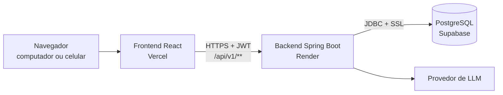
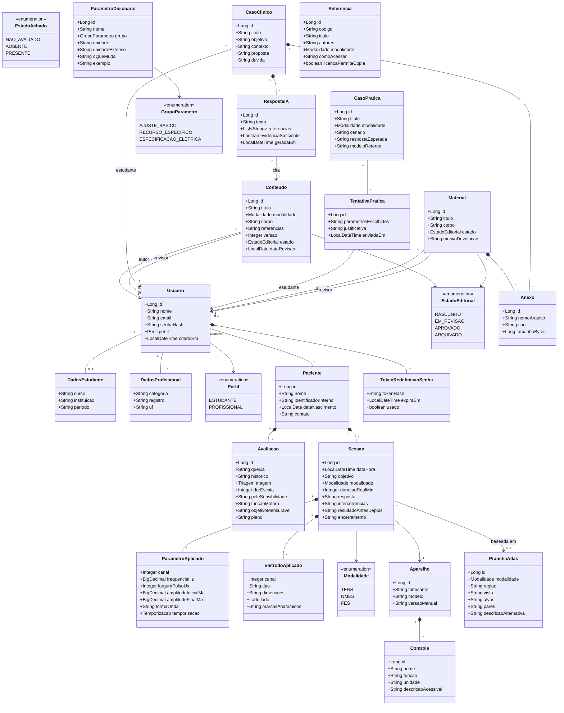
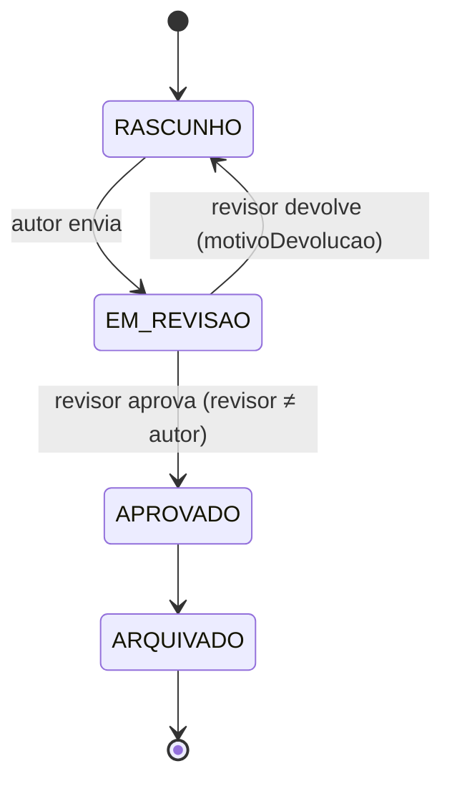
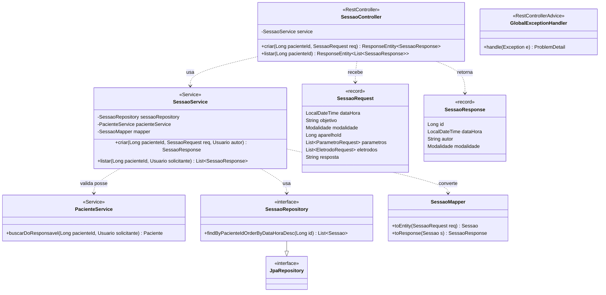
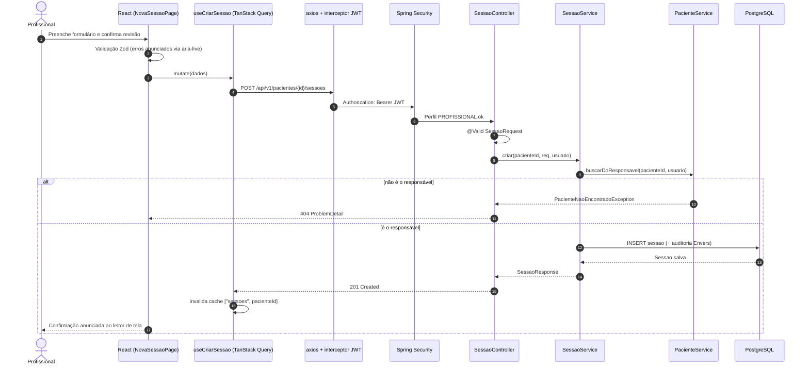
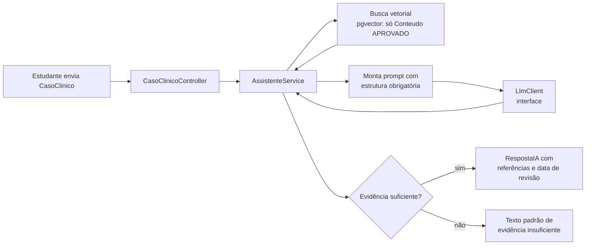
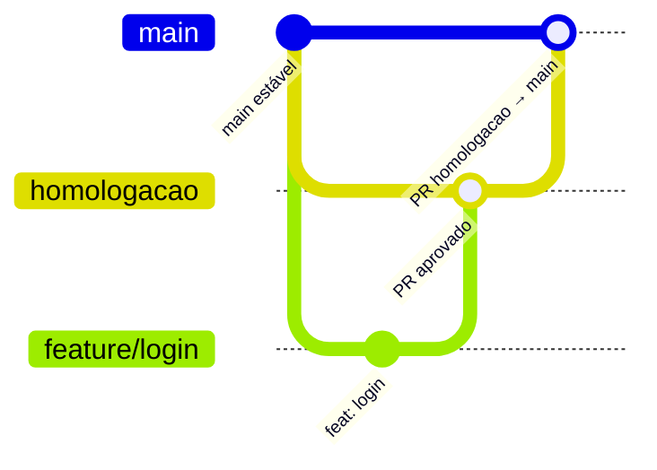

# TENS + FES — Backend (API)

API REST da plataforma educacional e clínica de eletroestimulação **TENS + FES**. Este repositório tem duas pastas:

- `backend/` (este documento): API em Java 25 + Spring Boot.
- `frontend/`: SPA em React + TypeScript. Veja `../frontend/README.md`.

O backend é a **única** porta de acesso ao banco. Toda regra de negócio e toda regra de acesso ficam aqui. O frontend só esconde a interface.

Documentos de origem (fora deste repositório, pasta `docs/` do projeto): `Prototipo_TENS_FES_Revisado.md`, `Guia_Tecnico_Implementacao_TENS_FES.md`, `uml_e_arquitetura_do_sistema_front_end_back_end.md` e `trello_cards.md`.

---

## Sumário

1. [Stack](#1-stack)
2. [Pré-requisitos](#2-pré-requisitos)
3. [Como rodar localmente](#3-como-rodar-localmente)
4. [Variáveis de ambiente](#4-variáveis-de-ambiente)
5. [Banco de dados (Supabase)](#5-banco-de-dados-supabase)
6. [Comandos](#6-comandos)
7. [Arquitetura](#7-arquitetura)
8. [Estrutura de pastas](#8-estrutura-de-pastas)
9. [Perfis e regras de acesso](#9-perfis-e-regras-de-acesso)
10. [UML — domínio](#10-uml--domínio)
11. [UML — camadas (feature Sessão)](#11-uml--camadas-feature-sessão)
12. [UML — sequência: registrar sessão](#12-uml--sequência-registrar-sessão)
13. [Módulo de IA (RAG)](#13-módulo-de-ia-rag)
14. [Convenções de código](#14-convenções-de-código)
15. [Testes](#15-testes)
16. [Branches, commits e Pull Requests](#16-branches-commits-e-pull-requests)
17. [Deploy](#17-deploy)
18. [Estado atual e pendências](#18-estado-atual-e-pendências)

---

## 1. Stack

| Camada | Tecnologia | Motivo |
|---|---|---|
| Linguagem | Java 25 | Versão LTS |
| Framework | Spring Boot 4.1.1 | Suporte oficial a Java 25 |
| HTTP | Spring Web MVC | API REST |
| Segurança | Spring Security + JWT | Perfis e posse do paciente |
| Persistência | Spring Data JPA (Hibernate) | Repositórios gerados pelo Spring |
| Migrations | Flyway | Schema versionado em SQL |
| Validação | Bean Validation (`@Valid`) | Valida o DTO na entrada |
| Auditoria | Hibernate Envers *(a adicionar)* | Registro clínico exige autoria e histórico |
| Banco | PostgreSQL no **Supabase** (+ pgvector para a IA) | Relacional e busca vetorial no mesmo banco |
| Contrato | springdoc-openapi 3.1.1 | Swagger UI; gera os tipos TypeScript do frontend |
| IA | Spring AI *(a adicionar)* | RAG sobre conteúdo revisado |
| Erros | `ProblemDetail` (RFC 9457) | Formato único de erro |
| Observabilidade | Spring Boot Actuator | `/actuator/health` |
| Testes | JUnit 5, Mockito, Testcontainers (PostgreSQL 17) | Integração com banco real |
| Build | Maven (wrapper `mvnw`) | Ninguém precisa instalar Maven |
| Deploy | Render | CI no GitHub Actions em todo PR |

Itens *(a adicionar)* entram junto com a feature que os usa. Não adicione dependência sem uso.

---

## 2. Pré-requisitos

| Ferramenta | Versão | Observação |
|---|---|---|
| JDK | **25** | Temurin recomendado. `JAVA_HOME` precisa apontar para o JDK 25 |
| Docker | qualquer recente | Só para os testes de integração (Testcontainers) |
| Git | qualquer | |
| Maven | não precisa | Use `./mvnw` (Linux/macOS/Git Bash) ou `.\mvnw.cmd` (PowerShell) |

Confira o Java:

```powershell
java -version          # deve mostrar 25
echo $env:JAVA_HOME    # deve apontar para o JDK 25
```

**Armadilha comum:** com o JDK 21 e o 25 instalados, o `JAVA_HOME` pode ficar no 21. O build falha com:

```
Fatal error compiling: error: release version 25 not supported
```

Correção na sessão atual do PowerShell:

```powershell
$env:JAVA_HOME = "C:\Program Files\Eclipse Adoptium\jdk-25.0.4.101-hotspot"
```

Para corrigir de vez, altere `JAVA_HOME` nas variáveis de ambiente do Windows.

---

## 3. Como rodar localmente

```powershell
git clone git@github.com:eksdat/tens-fes-web.git
cd tens-fes-web
git switch homologacao
cd backend

copy .env.example .env      # preencha com os dados do Supabase (seção 5)
```

O Spring **não** lê o arquivo `.env` sozinho. Carregue as variáveis antes de subir:

```powershell
# PowerShell: carrega o .env na sessão atual
Get-Content .env | Where-Object { $_ -and -not $_.StartsWith('#') } | ForEach-Object {
    $nome, $valor = $_ -split '=', 2
    Set-Item "env:$nome" $valor
}

.\mvnw.cmd spring-boot:run
```

No IntelliJ, outra opção: *Run Configuration › Environment variables* com os mesmos valores.

Confira se subiu:

| URL | Esperado |
|---|---|
| http://localhost:8080/actuator/health | `{"status":"UP"}` |
| http://localhost:8080/swagger-ui.html | Swagger UI |
| http://localhost:8080/v3/api-docs | Contrato OpenAPI em JSON |

### Rodar sem Supabase (banco local em Docker)

A classe de teste `TestTensFesApiApplication` sobe a API com um PostgreSQL 17 em container. Ela não precisa de `.env`:

```powershell
.\mvnw.cmd spring-boot:test-run
```

Use para desenvolver offline. Os dados somem ao parar.

---

## 4. Variáveis de ambiente

Todas ficam em `.env` (local) ou no painel do Render (produção). O arquivo `.env` está no `.gitignore`. **Nunca** faça commit de senha.

| Variável | Obrigatória | Exemplo | Uso |
|---|---|---|---|
| `DB_URL` | sim | `jdbc:postgresql://aws-0-sa-east-1.pooler.supabase.com:5432/postgres?sslmode=require` | JDBC do Supabase |
| `DB_USERNAME` | sim | `postgres.<project-ref>` | Usuário do pooler |
| `DB_PASSWORD` | sim | — | Senha do banco |
| `CORS_ALLOWED_ORIGINS` | não | `http://localhost:5173` | Origens do frontend, separadas por vírgula |

O mapeamento está em `src/main/resources/application.yml`.

---

## 5. Banco de dados (Supabase)

**Decisão:** o Supabase é usado **apenas como PostgreSQL gerenciado**.

- Login, perfis e regras de acesso ficam no Spring Boot.
- Não usar Supabase Auth.
- Não usar a API automática do Supabase (PostgREST) pelo frontend. Desativar ou deixar sem permissão.
- Motivo: a regra "profissional só vê o próprio paciente" fica num lugar só. Em dois lugares, um deles acaba esquecido e vira vazamento de prontuário.

Como pegar a conexão:

1. Supabase › *Project Settings* › *Database* › *Connection string*.
2. Escolha **Session pooler** (funciona em rede IPv4; a conexão direta exige IPv6).
3. Copie host, porta, usuário e senha para o `.env`. Mantenha `?sslmode=require`.

### Migrations (Flyway)

- Ficam em `src/main/resources/db/migration/`.
- Nome: `V<n>__<descricao>.sql`. Ex.: `V1__usuarios.sql`, `V2__pacientes.sql`.
- Rodam sozinhas ao subir a aplicação.
- **Nunca** edite uma migration que já foi aplicada em homologação ou produção. Crie uma nova.
- `spring.jpa.hibernate.ddl-auto=validate`: o Hibernate **não** cria tabela. Ele só confere se a entidade bate com o schema. Se não bater, a aplicação não sobe. Isso é proposital.
- Nunca altere o schema pelo painel do Supabase. Toda mudança passa por migration.

---

## 6. Comandos

| Comando (PowerShell) | O que faz |
|---|---|
| `.\mvnw.cmd spring-boot:run` | Sobe a API em `:8080` usando o Supabase |
| `.\mvnw.cmd spring-boot:test-run` | Sobe a API com PostgreSQL em Docker |
| `.\mvnw.cmd test` | Roda todos os testes (precisa de Docker) |
| `.\mvnw.cmd -DskipTests package` | Gera `target/tens-fes-api-0.0.1-SNAPSHOT.jar` |
| `java -jar target/tens-fes-api-0.0.1-SNAPSHOT.jar` | Roda o jar gerado |

---

## 7. Arquitetura

Visão do sistema inteiro:



Plataforma: uma versão web responsiva. Não há aplicativo nativo.

### Pacote por feature, camadas dentro da feature

Cada feature (`paciente`, `sessao`, ...) tem as próprias camadas:

| Camada | Anotação | Responsabilidade | Não pode |
|---|---|---|---|
| Controller | `@RestController` | Entrada HTTP. Valida o DTO com `@Valid`. Devolve `ResponseEntity` | Ter regra de negócio |
| Service | `@Service` | Regra de negócio, autorização por posse, `@Transactional`, conversão entidade ↔ DTO | Conhecer HTTP |
| Repository | `interface XRepository extends JpaRepository<X, Long>` | Acesso ao banco. O Spring gera a implementação | Ter regra |
| Entity | `@Entity` | Mapeamento JPA | Sair do backend |
| DTO | `record` | Contrato da API (`XRequest`, `XResponse`) | — |
| Mapper | classe ou MapStruct | Único ponto que liga entidade e DTO | — |
| Enum | `enum` | Constantes do domínio | — |

Regras de desenho:

- **A entidade nunca sai do backend.** Sempre DTO.
- **Não criar `IXService`** com uma implementação só. O Mockito mocka a classe concreta. Interface só existe com mais de uma implementação real ou quando o teste precisa de um fake. Caso atual: `LlmClient`.
- Erro sai como `ProblemDetail` (`spring.mvc.problemdetails.enabled=true`). Exceções de negócio ganham um `@RestControllerAdvice` em `shared/` quando a primeira existir.
- Rotas da API: prefixo `/api/v1`. Ex.: `POST /api/v1/pacientes/{id}/sessoes`.

### Segurança (`config/SecurityConfig.java`)

- API **stateless**: sem sessão HTTP, então sem CSRF.
- Liberados sem login: `/actuator/health`, `/swagger-ui/**`, `/v3/api-docs/**`.
- Todo o resto exige autenticação.
- `@EnableMethodSecurity` ativa `@PreAuthorize` nos controllers.
- CORS liberado só para `/api/**` e para as origens de `CORS_ALLOWED_ORIGINS`.
- O filtro JWT ainda não existe. Entra no card "Fazer login e sair".

---

## 8. Estrutura de pastas

```text
backend/
├── pom.xml
├── mvnw, mvnw.cmd, .mvn/          # Maven wrapper
├── .env.example                   # modelo das variáveis (copie para .env)
└── src/
    ├── main/
    │   ├── java/br/unibh/tensfes/
    │   │   ├── TensFesApiApplication.java
    │   │   ├── config/        # SecurityConfig, CORS, OpenAPI
    │   │   ├── shared/        # tratamento global de erro, exceções, auditoria
    │   │   ├── auth/          # login, cadastro, JWT, Usuario, Perfil, redefinição de senha
    │   │   ├── paciente/      # Paciente, Avaliacao
    │   │   ├── sessao/        # Sessao, ParametroAplicado, EletrodoAplicado
    │   │   ├── conteudo/      # Conteudo, Material, Anexo, Referencia, fluxo editorial
    │   │   ├── parametro/     # ParametroDicionario
    │   │   ├── aparelho/      # Aparelho, Controle
    │   │   ├── atlas/         # PranchaAtlas
    │   │   ├── simulador/     # CasoPratica, TentativaPratica
    │   │   ├── caso/          # CasoClinico
    │   │   └── assistente/    # AssistenteService, LlmClient, indexação RAG
    │   └── resources/
    │       ├── application.yml
    │       └── db/migration/  # V1__*.sql, V2__*.sql ...
    └── test/java/br/unibh/tensfes/
        ├── TensFesApiApplicationTests.java    # sobe o contexto com Postgres em container
        ├── TestcontainersConfiguration.java   # container PostgreSQL 17
        └── TestTensFesApiApplication.java     # roda a API local com o container
```

Cada pacote de feature tem um `package-info.java` que descreve a responsabilidade dele. Dentro da feature, os arquivos ficam juntos: `SessaoController`, `SessaoService`, `SessaoRepository`, `Sessao`, `SessaoRequest`, `SessaoResponse`, `SessaoMapper`. Não crie subpastas `controller/`, `service/` até a feature passar de uns 10 arquivos.

---

## 9. Perfis e regras de acesso

| Área | Estudante | Profissional |
|---|---|---|
| Conteúdos TENS/FES, biblioteca, atlas, aparelho | Consulta | Consulta |
| Simulador e casos fictícios | Acesso | Acesso |
| Criar materiais | Rascunho e envio | Contribuição para revisão |
| Pacientes / prontuário | **Sem acesso** | **Só os pacientes sob sua responsabilidade** |
| Casos para a IA | Envia caso fictício | Conteúdo revisado alimenta a base |

Regras obrigatórias no backend:

1. Endpoint de paciente exige `PROFISSIONAL` (`@PreAuthorize("hasRole('PROFISSIONAL')")`). `ESTUDANTE` recebe **403**.
2. Todo acesso a paciente, avaliação ou sessão confere `paciente.responsavel.id == usuarioLogado.id`. Se falhar, responde **404**, não 403. Assim não revela que o registro existe. O ponto único dessa verificação é `PacienteService.buscarDoResponsavel`.
3. Paciente não é usuário: sem login, sem conta.
4. Registro profissional digitado (CREFITO etc.) **não** gera selo de "verificado".
5. O autor não aprova o próprio material.
6. `Anexo`: só PDF e imagem, até 10 MB.
7. Token de redefinição de senha: guarda só o hash, uso único, expira em 30 minutos. "Esqueci a senha" responde a mesma mensagem exista ou não a conta.
8. Até as políticas LGPD estarem definidas: **somente dados fictícios**.

---

## 10. UML — domínio



Notas que o diagrama não mostra:

- `Triagem` e os campos de pele e função usam `EstadoAchado`. **Campo vazio não significa ausência de risco.** Por isso existe `NAO_AVALIADO`.
- `Paciente`, `Avaliacao` e `Sessao` são auditados com Envers (`@Audited`): quem alterou, quando e o quê.
- `RespostaIA` cita só `Conteudo` `APROVADO`. `CasoClinico` e anexos **nunca** entram na base da IA automaticamente.
- `ParametroAplicado` tem a unidade no nome do campo (`frequenciaHz`, `larguraPulsoUs`, `amplitudeInicialMa`).
- `ParametroDicionario` (texto do dicionário) ≠ `ParametroAplicado` (valor usado numa sessão real).
- `CasoPratica` = os 4 casos fictícios do simulador. `CasoClinico` = caso que o estudante envia para a IA.
- `Material` é criado por usuário. Aprovado, vira `Conteudo` publicado.

Fluxo editorial de `Material`/`Conteudo`:



---

## 11. UML — camadas (feature Sessão)

Modelo que toda feature segue:



---

## 12. UML — sequência: registrar sessão



---

## 13. Módulo de IA (RAG)



Regras:

- A resposta segue 7 passos: objetivo, o que falta, conceitos, comparação, riscos, referências com data e pergunta de aprendizagem.
- Texto de caso ou anexo entra como **dado**, nunca como instrução. Instrução escondida num anexo não muda regra nem acesso (proteção contra prompt injection).
- Prontuário não é indexado. O indexador lê só `conteudo` com `estado = APROVADO`.
- `LlmClient` é interface: troca de provedor e fake nos testes.

---

## 14. Convenções de código

- Código, nomes de classe e de campo em **português** do domínio (`Paciente`, `buscarDoResponsavel`). Termos técnicos do framework ficam como são (`Controller`, `Repository`).
- Comentário só explica **por quê**. Nada de comentário que repete o código, código comentado ou `TODO` sem dono.
- Solução mais simples que resolve o problema de hoje. Sem abstração "para o futuro".
- DTO é `record`. Entidade nunca é serializada.
- Unidade física no nome do campo (`Hz`, `Us`, `Ma`).
- Datas: `LocalDate`/`LocalDateTime`. Dinheiro e medidas com casa decimal: `BigDecimal`.

---

## 15. Testes

| Tipo | Ferramenta | O que cobre |
|---|---|---|
| Unitário | JUnit 5 + Mockito | Regra de negócio no Service |
| Integração | `@SpringBootTest` + Testcontainers (PostgreSQL 17) | Controller → banco real, migrations, segurança |
| Segurança | `spring-security-test` | 403 para estudante, 404 para paciente de outro profissional |

Regras:

- **TDD**: bug novo começa com teste que reproduz o bug e falha. Regra de negócio nova começa pelo teste.
- Nome do teste descreve o comportamento: `deveResponder404QuandoPacienteEDeOutroProfissional`.
- Um comportamento por teste. Sem `if`/`for` no teste.
- Sem dependência de ordem, relógio real ou rede externa. LLM sempre por fake de `LlmClient`.
- Testes de integração **precisam do Docker rodando**. Sem Docker, `TensFesApiApplicationTests` falha ao subir o container.

---

## 16. Branches, commits e Pull Requests



| Branch | Papel | Quem escreve |
|---|---|---|
| `main` | Produção. Sempre estável | Só por PR vindo de `homologacao` |
| `homologacao` | Integração e teste antes da produção | Só por PR vindo de `feature/*` ou `fix/*` |
| `feature/<descricao>` | Funcionalidade nova. Sai de `homologacao` | Autor |
| `fix/<descricao>` | Correção. Sai de `homologacao` | Autor |
| `hotfix/<descricao>` | Correção urgente em produção. Sai de `main`, volta para `main` **e** `homologacao` | Autor |

Fluxo:

1. `git switch homologacao && git pull`
2. `git switch -c feature/cadastro-paciente`
3. Commits pequenos. Rode build e testes.
4. Push e PR para `homologacao`.
5. **O outro dev revisa e aprova.** Ninguém aprova o próprio PR.
6. CI verde + aprovação: merge em `homologacao`.
7. Validado em homologação: PR `homologacao` → `main`, também com aprovação do outro dev.

Proibido: push direto em `main` ou `homologacao`, `push --force` nessas duas, merge com CI vermelho.

Commits: uma linha, imperativo, prefixo [Conventional Commits](https://www.conventionalcommits.org/pt-br/):

```
feat: cadastra paciente com responsável
fix: responde 404 quando paciente é de outro profissional
docs: explica conexão com Supabase no README
test: cobre redefinição de senha expirada
chore: atualiza springdoc para 3.1.1
```

Sem linha de coautoria nem assinatura de ferramenta.

---

## 17. Deploy

| Ambiente | Branch | Onde |
|---|---|---|
| Homologação | `homologacao` | Render (serviço de homologação) |
| Produção | `main` | Render |

- Build: `./mvnw -DskipTests package`. Start: `java -jar target/tens-fes-api-0.0.1-SNAPSHOT.jar`.
- Variáveis da seção 4 no painel do Render.
- `CORS_ALLOWED_ORIGINS` com a URL do frontend na Vercel.
- CI (GitHub Actions) roda `./mvnw test` em todo PR. *(Workflow ainda não criado.)*

---

## 18. Estado atual e pendências

Pronto nesta base:

- Projeto Spring Boot 4.1.1 / Java 25 gerado, compilando (`mvnw package` ok).
- Pacotes por feature criados (vazios, com `package-info.java`).
- `SecurityConfig` stateless com CORS.
- `application.yml` lendo conexão do ambiente; Flyway e `ddl-auto=validate`.
- springdoc (Swagger UI) e Actuator.
- Testcontainers configurado com PostgreSQL 17.

Pendente:

- Filtro JWT, login e cadastro (`auth/`).
- Primeira migration (`V1__usuarios.sql`).
- Envers, Spring AI e pgvector (entram com as features).
- `@RestControllerAdvice` para exceções de negócio.
- Workflow do GitHub Actions.
- Políticas LGPD (retenção, backup, incidentes, exportação). Até lá, só dados fictícios.
- Aparelho de referência e manual. Provedor de LLM e limite de custo.
