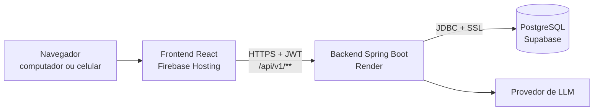
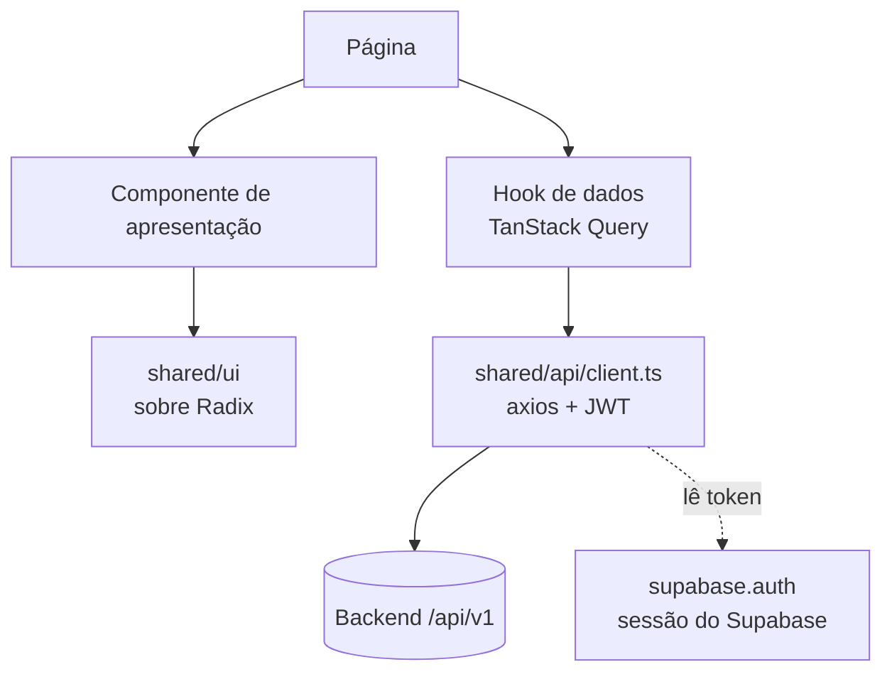
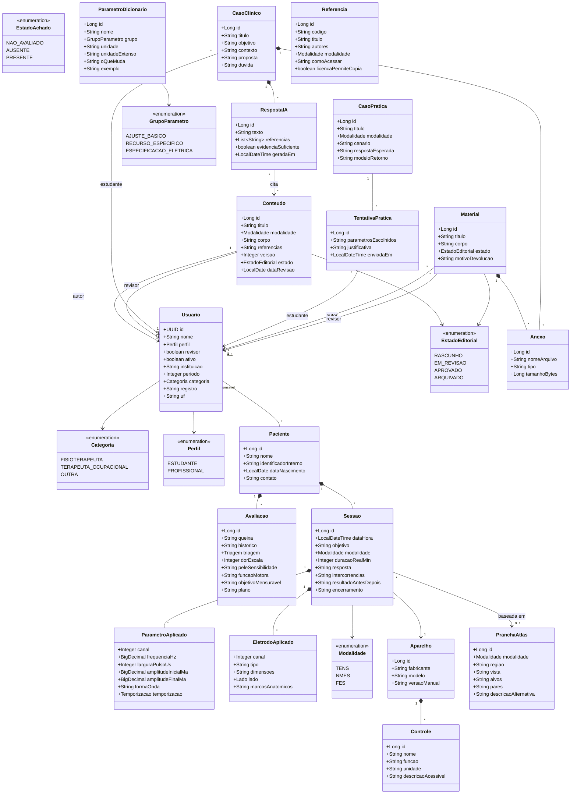
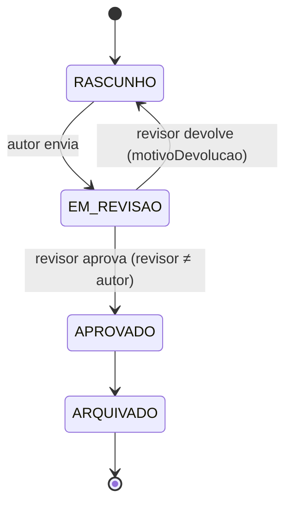
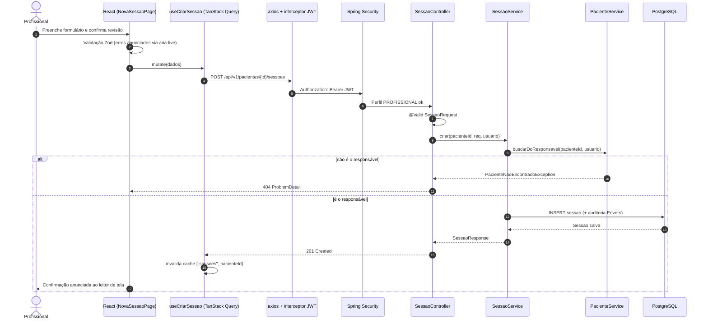
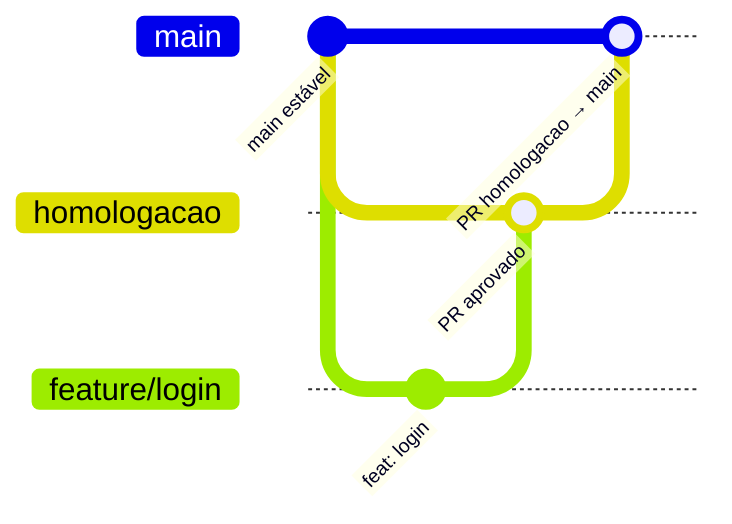

# Fisiotech — Frontend (Web)

SPA da plataforma educacional e clínica de eletroestimulação **Fisiotech** (TENS, NMES e FES). Este repositório tem duas pastas:

- `frontend/` (este documento): React 19 + TypeScript + Vite.
- `backend/`: API em Java 25 + Spring Boot. Veja `../backend/README.md`.

O frontend **nunca** fala direto com o banco. Todo dado passa pela API do backend (`/api/v1/**`). As regras de acesso valem no backend; aqui elas só escondem a interface.

Documentos de origem (fora deste repositório, pasta `docs/` do projeto): `Prototipo_TENS_FES_Revisado.md`, `Guia_Tecnico_Implementacao_TENS_FES.md`, `uml_e_arquitetura_do_sistema_front_end_back_end.md` e `trello_cards.md`.

---

## Sumário

1. [Stack](#1-stack)
2. [Pré-requisitos](#2-pré-requisitos)
3. [Como rodar localmente](#3-como-rodar-localmente)
4. [Variáveis de ambiente](#4-variáveis-de-ambiente)
5. [Comandos](#5-comandos)
6. [Arquitetura](#6-arquitetura)
7. [Estrutura de pastas](#7-estrutura-de-pastas)
8. [Autenticação no frontend](#8-autenticação-no-frontend)
9. [Perfis e regras de acesso](#9-perfis-e-regras-de-acesso)
10. [Mapa de telas](#10-mapa-de-telas)
11. [UML — domínio](#11-uml--domínio)
12. [UML — sequência: registrar sessão](#12-uml--sequência-registrar-sessão)
13. [Acessibilidade](#13-acessibilidade)
14. [Convenções de código](#14-convenções-de-código)
15. [Testes](#15-testes)
16. [Branches, commits e Pull Requests](#16-branches-commits-e-pull-requests)
17. [Deploy](#17-deploy)
18. [Estado atual e pendências](#18-estado-atual-e-pendências)

---

## 1. Stack

| Camada | Tecnologia | Motivo |
|---|---|---|
| UI | React 19 + TypeScript 6 | Tipagem forte |
| Build / dev server | Vite 8 | Rápido, HMR |
| Rotas | React Router 7 (`react-router`) | Rotas protegidas por perfil |
| Dados remotos | TanStack Query + axios | Cache, loading e erro sem código repetido |
| Formulários | React Hook Form + Zod 4 | Validação declarativa; mensagens acessíveis |
| Login e sessão | `@supabase/supabase-js` (só `supabase.auth.*`) | Identidade no Supabase Auth; dados sempre pela API |
| Visual | CSS próprio com tokens (`src/styles`) e fontes auto-hospedadas (`@fontsource`: Big Shoulders Display, Ubuntu, Ubuntu Mono) | Identidade do protótipo; sem Google Fonts, por causa da CSP e da LGPD |
| Componentes base | Radix UI (`radix-ui`) *(a usar em diálogos, menus e seletores)* | Foco, teclado e ARIA corretos por padrão |
| Aparelho 3D | react-three-fiber *(a adicionar)* | Modelo 3D com lista textual equivalente |
| Tipos da API | `openapi-typescript` | Gerados do contrato do backend |
| Lint | oxlint com plugin `jsx-a11y` | Lint rápido + regras de acessibilidade |
| Testes | Vitest + Testing Library + jsdom; `vitest-axe`; Playwright *(a adicionar)* | Unitário, componente, a11y, e2e |
| Deploy | Firebase Hosting (Spark) | Guia em [DEPLOY.md](../DEPLOY.md) |

> A doc de arquitetura cita ESLint + `eslint-plugin-jsx-a11y`. O template atual do Vite traz **oxlint**, que tem o mesmo conjunto de regras `jsx-a11y`. Ficamos com o oxlint para não manter dois linters.

---

## 2. Pré-requisitos

| Ferramenta | Versão |
|---|---|
| Node.js | 24 LTS ou mais novo |
| npm | 11+ (vem com o Node) |
| Backend rodando | para telas que chamam a API (ver `../backend/README.md`) |

```powershell
node -v
npm -v
```

---

## 3. Como rodar localmente

```powershell
git clone git@github.com:eksdat/tens-fes-web.git
cd tens-fes-web
git switch homologacao
cd frontend

npm install
npm run dev
```

Abra http://localhost:5173. `npm run dev` já aponta para o **backend e o Supabase locais** (`.env.development`, valores públicos). Suba os dois antes, como em "Rodar com o Supabase local" no [README do backend](../backend/README.md): `npx supabase start` na raiz e o backend com o perfil `local`. O e-mail de confirmação do cadastro sai pelo SMTP configurado em `supabase/.env` (ou cai no Mailpit, http://127.0.0.1:54324, se o SMTP estiver desligado).

Para usar a nuvem no `npm run dev`, crie `.env.development.local` (ignorado pelo git) com `VITE_API_URL`, `VITE_SUPABASE_URL` e `VITE_SUPABASE_PUBLISHABLE_KEY` reais (modelo em `.env.example`).

- Sem login, qualquer rota protegida redireciona para `/login`.
- O backend precisa liberar a origem `http://localhost:5173` em `CORS_ALLOWED_ORIGINS` (já é o padrão).

---

## 4. Variáveis de ambiente

`npm run dev` lê `.env.development` (versionado, só valores locais públicos) e `.env.development.local` (sobrescreve, ignorado pelo git). O build de produção lê `.env.production.local` (ignorado; ver [DEPLOY.md](../DEPLOY.md)). O `.env.example` é o modelo para a nuvem.

| Variável | Obrigatória | Exemplo | Uso |
|---|---|---|---|
| `VITE_API_URL` | sim | `http://localhost:8080` | URL base do backend, sem `/api/v1` |
| `VITE_SUPABASE_URL` | sim | `http://127.0.0.1:54321` | URL do Supabase (local no `dev`) |
| `VITE_SUPABASE_PUBLISHABLE_KEY` | sim | `sb_publishable_...` | Chave publicável. Nunca a secret/service_role |
| `VITE_TURNSTILE_SITE_KEY` | não | `0x4AAAA...` | Site Key do CAPTCHA (Cloudflare Turnstile). Vazia: sem CAPTCHA. No `npm run dev` vai a chave de teste, que sempre aprova |

Toda variável com prefixo `VITE_` vai para o bundle e **fica pública** no navegador. Nunca coloque segredo aqui. A chave publicável do Supabase é pública por desenho; a secret/service_role nunca entra no frontend.

---

## 5. Comandos

| Comando | O que faz |
|---|---|
| `npm run dev` | Servidor de desenvolvimento em `:5173` |
| `npm run build` | Checagem de tipos (`tsc -b`) + build em `dist/` |
| `npm run preview` | Serve o `dist/` para conferir o build |
| `npm run lint` | oxlint (inclui regras de acessibilidade) |
| `npm test` | Vitest, uma execução |
| `npx vitest` | Vitest em modo watch |
| `npm run api:types` | Gera `src/shared/api/schema.d.ts` a partir de `http://localhost:8080/v3/api-docs` (backend precisa estar rodando) |

---

## 6. Arquitetura

Visão do sistema inteiro:



Plataforma: uma versão web responsiva (computador e navegador do celular). Não há aplicativo nativo.

**Supabase:** usado só como banco pelo backend. O frontend não usa Supabase Auth nem `@supabase/supabase-js`. Motivo: a regra "profissional só vê o próprio paciente" fica num lugar só, o backend.

### Organização por feature

Cada feature tem suas páginas, componentes, hooks de dados e schemas juntos. O que é usado por várias features fica em `shared/`.

- `shared` não importa de `features`; feature não importa de outra feature; quem compõe várias fica em `app/`.
- Teste ao lado do arquivo; helper de render em `src/test/renderComRotas.tsx`.

| Peça | Papel | Pode | Não pode |
|---|---|---|---|
| Página (container) | Busca dados por hook e orquestra componentes | Usar hooks de dados | — |
| Componente de apresentação | Recebe `props`, dispara callbacks | Ter estado de UI | Chamar HTTP |
| Hook de dados (`usePacientes`, `useCriarSessao`) | Envolve `useQuery`/`useMutation` | Chamar `api` | Renderizar |
| Cliente API (`shared/api/client.ts`) | Instância axios com JWT e tratamento de 401 | — | Ter regra de negócio |
| Schema Zod (`schemas.ts`) | Validação do formulário | — | — |
| Tipos | Gerados do OpenAPI | — | Ser escritos à mão |



---

## 7. Estrutura de pastas

```text
frontend/
├── index.html                 # lang="pt-BR", theme-color, favicon
├── package.json
├── vite.config.ts             # plugin React + config do Vitest (variáveis VITE_* de teste)
├── firebase.json, .firebaserc # Firebase Hosting (ver DEPLOY.md)
├── .oxlintrc.json             # lint, com jsx-a11y
├── .env.example
├── public/
│   └── favicon.svg            # folha da marca com pulso
└── src/
    ├── main.tsx               # fontes, estilos, Providers + RouterProvider
    ├── vite-env.d.ts          # tipos das variáveis VITE_* e dos módulos @fontsource
    ├── styles/
    │   ├── tokens.css         # cores, espaço, cantos, fontes (somente tema claro)
    │   ├── base.css           # reset mínimo, foco visível, reduced motion
    │   └── ui.css             # componentes (classes tf-*) e layout das telas de autenticação
    ├── app/
    │   ├── providers.tsx      # QueryClientProvider + AuthProvider
    │   ├── router.tsx         # todas as rotas
    │   └── ProtectedRoute.tsx # guarda de rotas (sessão, cadastro, perfil, MFA); compõe auth, mfa e usuario
    ├── shared/
    │   ├── api/
    │   │   ├── supabase.ts    # cliente do Supabase (só auth)
    │   │   ├── client.ts      # axios: baseURL, Bearer do Supabase, 401 → encerra a sessão
    │   │   └── schema.d.ts    # GERADO por `npm run api:types` — não editar
    │   ├── auth/
    │   │   ├── contexto.ts        # AuthContext (tipo e contexto)
    │   │   ├── AuthContext.tsx    # AuthProvider: reflete onAuthStateChange
    │   │   ├── useAuth.ts         # hook de acesso ao contexto
    │   │   └── armazenamento.ts   # "Manter conectado": localStorage ou sessionStorage
    │   └── ui/                # Marca, Botao, BotaoLink, Campo, CampoSenha, Alerta, AuthLayout, FolhasDecorativas, Icones, TelaCarregando
    ├── features/
    │   ├── auth/
    │   │   ├── schemas.ts     # emailSchema, senhaNovaSchema (usados por login, cadastro e senha)
    │   │   ├── login/         # LoginPage, BotaoGoogle, AuthCallbackPage
    │   │   ├── cadastro/      # CadastroPage (2 etapas + verificação), CompletarCadastroPage, PerfilCampos,
    │   │   │                  # CampoAceiteTermos, cadastro.ts, cadastroSeguro.ts
    │   │   ├── senha/         # EsqueciSenhaPage, NovaSenhaPage, RequisitosSenha, forcaSenha.ts (zxcvbn-ts)
    │   │   └── captcha/       # captcha.tsx (useCaptcha), CampoCaptcha
    │   ├── termos/            # TermosDeUsoPage, PoliticaPrivacidadePage, DocumentoLegal (textos preliminares)
    │   ├── mfa/               # AtivarMfaPage, VerificarMfaPage, useNivelMfa (AAL da sessão), CampoCodigo
    │   ├── usuario/           # useUsuarioAtual (GET /usuarios/me)
    │   ├── inicio/            # InicioPage (provisória)
    │   ├── perfil/            # a criar
    │   ├── modulos/           # TENS e FES, aba Segurança (a criar)
    │   ├── dicionario/        # a criar
    │   ├── aparelho/          # Aparelho3D + ListaControles (a criar)
    │   ├── atlas/             # a criar
    │   ├── simulador/         # a criar
    │   ├── conteudo/          # CriarConteudo, Revisao, Biblioteca (a criar)
    │   ├── casos/             # a criar
    │   └── pacientes/         # a criar, com o formato abaixo
    │       ├── api/           # usePacientes, useCriarSessao
    │       ├── pages/
    │       ├── components/
    │       └── schemas.ts     # Zod
    └── test/
        ├── setup.ts           # jest-dom, vitest-axe e limpeza do armazenamento
        ├── renderComRotas.tsx # QueryClientProvider + MemoryRouter + Routes para testes de página
        └── vitest-axe.d.ts    # tipo do matcher toHaveNoViolations
e2e/                           # Playwright (a criar)
```

Crie a pasta da feature quando a primeira tela dela for feita. Não deixe pasta vazia.

### Identidade visual

O guia completo (tokens, componentes, regras de conteúdo, capturas de tela e protótipo) está em [docs/design-system/README.md](docs/design-system/README.md). Leia antes de criar ou alterar uma tela. Resumo:

O protótipo (design system de referência) é só uma referência visual: cores, tipografia, cartões e campos. Fluxos e regras seguem este projeto. Pontos que valem lembrar:

- **Só tema claro.** O tema escuro do design system não foi adotado; `color-scheme: light` fixo.
- **Fonte de verdade dos tokens:** o `tokens.json` do design system, não o `tokens.css` gerado dele (que está desatualizado). Os valores estão em `src/styles/tokens.css`.
- **Fontes auto-hospedadas** (só o subconjunto latino): a CSP do `firebase.json` não permite Google Fonts.
- **Contraste e foco:** borda de 2 px, sombra rígida sem desfoque, foco de 3 px, alvos de toque de no mínimo 44 px, campos com 16 px ou mais (o iOS não dá zoom).
- **Responsivo, mobile primeiro:** uma coluna até 880 px; duas colunas (painel verde e cartão) a partir daí; cartão com borda e sombra a partir de 720 px.

---

## 8. Autenticação no frontend

1. O cliente `@supabase/supabase-js` (`shared/api/supabase.ts`) usa só `VITE_SUPABASE_URL` e `VITE_SUPABASE_PUBLISHABLE_KEY`, e **só** em `supabase.auth.*`. Nunca `from()`, `rpc()`, `storage` ou `realtime`.
2. **Login:** `signInWithPassword`. Credencial errada mostra "E-mail ou senha incorretos." (sem dizer qual). E-mail não confirmado oferece reenviar o link (`auth.resend`).
3. **"Manter conectado":** marcado, a sessão fica no `localStorage`; desmarcado (padrão), no `sessionStorage` (some ao fechar a aba). Ver `shared/auth/armazenamento.ts`.
4. **Esqueci a senha:** `resetPasswordForEmail`, com a mesma mensagem exista ou não a conta. O link abre `/nova-senha`, que usa a sessão temporária de recuperação (`updateUser`).
5. **Link de confirmação do e-mail** abre `/auth/callback`: o supabase-js abre a sessão e a rota protegida decide o resto.
6. `client.ts` envia `Authorization: Bearer <access_token>` da sessão atual (renovada pelo SDK).
7. O **perfil** vem de `GET /api/v1/usuarios/me` (`useUsuarioAtual`, TanStack Query), nunca do token nem do `localStorage`.
8. **401** da API: encerra a sessão, e a rota protegida leva ao login. **403**: perfil sem permissão (mensagem, sem deslogar). **404** em paciente: "não encontrado", nunca "sem permissão".
9. Se a API não responde (por exemplo, o servidor do plano grátis ainda subindo, cerca de 3 min), a rota protegida mostra "Não foi possível carregar seus dados" com "Tentar de novo".

`ProtectedRoute` decide só a navegação, em 3 estados: sem sessão (`/login`), logado sem cadastro completo (`/completar-cadastro`) e logado com perfil (rotas do perfil).

---

## 9. Perfis e regras de acesso

| Área | Estudante | Profissional |
|---|---|---|
| Conteúdos TENS/FES, biblioteca, atlas, aparelho | Consulta | Consulta |
| Simulador e casos fictícios | Acesso | Acesso |
| Criar materiais | Rascunho e envio | Contribuição para revisão |
| Pacientes / prontuário | **Sem acesso** | **Só os pacientes sob sua responsabilidade** |
| Casos para a IA | Envia caso fictício | Conteúdo revisado alimenta a base |

Regras que o frontend precisa respeitar:

- Esconder menus e rotas que o perfil não usa. Isso é conforto, não segurança.
- Paciente não é usuário: não existe tela de login de paciente.
- Registro profissional digitado **não** mostra selo de "verificado".
- Anexo: só PDF e imagem, até 10 MB. Validar antes do upload; o backend valida de novo.
- "Esqueci a senha": mesma mensagem exista ou não a conta.
- Até as políticas LGPD estarem definidas: **somente dados fictícios**.

---

## 10. Mapa de telas

| Rota | Perfil | Página | Observações |
|---|---|---|---|
| `/login`, `/cadastro` | público | `LoginPage`, `CadastroPage` | Cadastro em etapas: dados comuns, depois perfil. Os dois têm "Continuar com o Google" (`BotaoGoogle`): quem entra assim e não tem cadastro cai em `/completar-cadastro` com o nome sugerido |
| `/mfa/verificar` | logado com autenticador | `VerificarMfaPage` | Código de 6 dígitos depois da senha; a sessão sobe para `aal2` |
| `/mfa/ativar` | logado | `AtivarMfaPage` | QR code e chave manual, confirma com o primeiro código. Obrigatória para PROFISSIONAL (`ProtectedRoute` redireciona) |
| `/completar-cadastro` | logado sem perfil | `CompletarCadastroPage` | Envia sozinha os dados guardados no e-mail; senão mostra o formulário |
| `/termos`, `/privacidade` | público | `TermosDeUsoPage`, `PoliticaPrivacidadePage` | Abrem em outra aba a partir do cadastro; texto preliminar |
| `/esqueci-senha`, `/nova-senha` | público | `EsqueciSenhaPage`, `NovaSenhaPage` | Mesma mensagem exista ou não a conta. Em `/nova-senha`, quem tem autenticador digita o código antes (o Supabase só troca a senha em sessão `aal2`); senha igual à atual é recusada pela API (`same_password`) |
| `/` | ambos | `InicioPage` | Atalhos conforme o perfil |
| `/tens/*`, `/fes/*` | ambos | `ModuloPage` | Abas: visão geral, aparelho, eletrodos, parâmetros, segurança, casos |
| `/aparelho/:id` | ambos | `AparelhoPage` | Canvas 3D + `ListaControles` textual com as mesmas funções |
| `/atlas` | ambos | `AtlasPage` | Descrição alternativa em toda prancha |
| `/dicionario` | ambos | `DicionarioPage` | Três grupos de parâmetros; busca por nome; unidade lida por extenso |
| `/simulador` | ambos | `SimuladorPage` | Modos explorar e praticar; pulso com descrição textual |
| `/biblioteca` | ambos | `BibliotecaPage` | Cartões de referência com filtro por modalidade |
| `/criar` | ambos | `CriarConteudoPage` | Rascunho, depois envio para revisão |
| `/revisao` | profissional | `RevisaoPage` | Aprovar ou devolver materiais em revisão |
| `/casos` | estudante | `CasosPage` | Envio para a IA |
| `/pacientes/**` | profissional | `PacientesPage`, `PacienteDetalhePage`, `AvaliacaoPage`, `NovaSessaoPage`, `EvolucaoPage`, `RelatorioPage` | Gráfico de evolução com tabela equivalente |
| `/perfil` | ambos | `PerfilPage` | Troca de estudante para profissional |

Hoje existem só `/login` e `/`.

---

## 11. UML — domínio

O frontend consome estas entidades pela API, sempre como DTO. Nunca recria regra de negócio delas.



O que muda na tela por causa do modelo:

- Campos de triagem, pele e função usam `EstadoAchado`. O formulário oferece **"Não avaliado"** explícito. Campo vazio não significa ausência de risco.
- Campos de `ParametroAplicado` mostram a unidade ao lado do input (Hz, µs, mA) e a unidade por extenso para leitor de tela.
- `ParametroDicionario` (página `/dicionario`) ≠ `ParametroAplicado` (formulário de sessão).
- `CasoPratica` = os 4 casos do simulador. `CasoClinico` = caso enviado para a IA em `/casos`.
- `RespostaIA` exibe referências e data de revisão. Com `evidenciaSuficiente = false`, mostra o aviso padrão.

Fluxo editorial de material (telas `/criar` e `/revisao`):



O botão "Aprovar" não aparece para o autor do material.

---

## 12. UML — sequência: registrar sessão



Padrão de chave do TanStack Query: `[recurso, ...ids]`. Ex.: `["pacientes"]`, `["sessoes", pacienteId]`. Toda mutation invalida a chave do recurso que mudou.

---

## 13. Acessibilidade

Meta: **WCAG 2.2 AA**. Testes manuais com NVDA, VoiceOver e TalkBack.

- Toda função do 3D existe também na lista textual (`ListaControles`). O 3D é complemento.
- Erro de formulário ligado ao campo por `aria-describedby`, com `aria-invalid`. Erro geral em `role="alert"`. Veja `src/features/auth/login/LoginPage.tsx`.
- Todo `input` tem `label` com `htmlFor`.
- Foco previsível ao abrir e fechar diálogos (Radix garante).
- Foco sempre visível (`:focus-visible` em `src/index.css`).
- Informação nunca depende só de cor. Gráfico tem tabela ou resumo textual.
- Imagem e prancha do atlas sempre com descrição alternativa.
- `oxlint` com `jsx-a11y` no lint; `vitest-axe` nos testes de componente.

---

## 14. Convenções de código

- Nomes em **português** do domínio (`entrar`, `sair`, `Sessao`, `usePacientes`). Termos de biblioteca ficam como são.
- Componente: `PascalCase.tsx`. Hook: `useAlgo.ts`. Teste ao lado do arquivo: `Algo.test.tsx`.
- Exportação nomeada. Sem `export default` (exceto config de ferramenta).
- Componente de apresentação não chama HTTP.
- Não escreva tipo de DTO à mão: use `schema.d.ts` gerado.
- Comentário só explica **por quê**. Nada de código comentado ou `TODO` sem dono.
- Solução mais simples para o problema de hoje. Sem abstração "para o futuro".

---

## 15. Testes

| Tipo | Ferramenta | Onde |
|---|---|---|
| Unitário / componente | Vitest + Testing Library + jsdom | `src/**/*.test.tsx` |
| Acessibilidade automática | `vitest-axe` | nos testes de componente |
| End-to-end | Playwright *(a adicionar)* | `e2e/` |

Regras:

- **TDD**: bug novo começa com teste que falha. Regra nova começa pelo teste.
- Nome descreve comportamento: `deveRedirecionarEstudanteQueTentaAbrirPacientes`.
- Teste o que o usuário vê (texto, papel, label), não detalhe interno.
- Sem dependência de ordem, relógio real ou rede. Chamadas HTTP mockadas.
- `src/test/setup.ts` limpa o DOM e o `localStorage` depois de cada teste.

Exemplo atual: `src/app/ProtectedRoute.test.tsx` (3 testes).

---

## 16. Branches, commits e Pull Requests



| Branch | Papel | Quem escreve |
|---|---|---|
| `main` | Produção. Sempre estável | Só por PR vindo de `homologacao` |
| `homologacao` | Integração e teste antes da produção | Só por PR vindo de `feature/*` ou `fix/*` |
| `feature/<descricao>` | Funcionalidade nova. Sai de `homologacao` | Autor |
| `fix/<descricao>` | Correção. Sai de `homologacao` | Autor |
| `hotfix/<descricao>` | Correção urgente em produção. Sai de `main`, volta para `main` **e** `homologacao` | Autor |

Fluxo:

1. `git switch homologacao && git pull`
2. `git switch -c feature/tela-login`
3. Commits pequenos. Rode `npm run lint`, `npm test` e `npm run build`.
4. Push e PR para `homologacao`.
5. **O outro dev revisa e aprova.** Ninguém aprova o próprio PR.
6. CI verde + aprovação: merge em `homologacao`.
7. Validado em homologação: PR `homologacao` → `main`, também com aprovação do outro dev.

Proibido: push direto em `main` ou `homologacao`, `push --force` nessas duas, merge com CI vermelho.

Commits: uma linha, imperativo, prefixo [Conventional Commits](https://www.conventionalcommits.org/pt-br/):

```
feat: adiciona tela de login com validação acessível
fix: redireciona para login após 401
docs: explica variáveis de ambiente no README
test: cobre ProtectedRoute por perfil
chore: atualiza vite para 8.3
```

Sem linha de coautoria nem assinatura de ferramenta.

---

## 17. Deploy

Frontend no **Firebase Hosting** (plano Spark). Só existe o ambiente de produção; a branch `homologacao` é etapa de revisão no git.

- `frontend/firebase.json`: publica `dist`, devolve `index.html` para toda rota (SPA), define a CSP e os demais cabeçalhos de segurança e roda `npm run build` antes do deploy.
- `frontend/.firebaserc` (no repositório) liga a pasta ao projeto Firebase.
- Build de produção lê `frontend/.env.production.local` (API, Supabase). Nunca no commit.
- Deploy manual: `firebase deploy --only hosting`. Passo a passo e conferência em **[DEPLOY.md](../DEPLOY.md)**.
- **Não rodar `firebase init`**: ele regrava o `firebase.json` e apaga a CSP, os cabeçalhos, o `predeploy` e o cache (`git restore frontend/firebase.json` desfaz). Armadilhas em [DEPLOY.md](../DEPLOY.md), seção 3.
- CORS: o backend (Render) precisa listar a URL do site em `CORS_ALLOWED_ORIGINS`.
- CSP estrita (`script-src 'self'`): ao incluir o CAPTCHA (Turnstile) ou uma biblioteca que injete estilo, ajustar o `frontend/firebase.json`.
- CI de frontend (GitHub Actions): ainda não criado.

---
## 18. Estado atual e pendências

Pronto:

- Vite + React 19 + TypeScript; dependências da stack instaladas.
- Base visual: tokens, fontes auto-hospedadas, componentes (`shared/ui`) e layout responsivo das telas de autenticação.
- Favicon (folha com pulso) e `theme-color`.
- Sessão pelo Supabase Auth, cliente HTTP com o token, `useUsuarioAtual` e `ProtectedRoute` de 3 estados.
- Telas: entrar, esqueci a senha, nova senha e retorno do link do e-mail.
- Tipos da API gerados do OpenAPI (`schema.d.ts`).
- Vitest com `vitest-axe`: 39 testes (armazenamento, validação, componentes, login com acessibilidade e rotas). Lint e build ok.

Pendente:

- Revisão jurídica/LGPD dos textos de Termos de uso e Política de privacidade (hoje preliminares; falta canal de contato do titular).
- MFA: exigir `aal2` na API (endpoints de paciente), códigos de recuperação e troca de aparelho (hoje, perder o celular exige remover o fator pelo painel do Supabase).
- CAPTCHA (Turnstile) no cadastro.
- Ícones PNG (apple-touch-icon) e manifesto do app.
- Componentes de `shared/ui` sobre Radix (diálogos, menus, seletores), quando surgirem.
- Demais telas do mapa (seção 10).
- `openapi-typescript`: hoje roda por `npx` no script `api:types`, porque a versão 7.13 pede TypeScript 5 e o projeto usa 6. Instalar como dependência quando sair versão compatível.
- Playwright (inclui comparação visual em 320, 390, 768 e 1280 px), react-three-fiber, workflow de CI e deploy automático no Firebase.
- Teste com leitor de tela real (NVDA, VoiceOver, TalkBack).
- Bundle passa de 500 kB: dividir rotas com `lazy()` quando houver mais telas.
