# Design system do Fisiotech

Guia visual e de interface para quem for criar ou alterar telas do frontend. Reúne o design system do protótipo (tokens, componentes e regras de conteúdo) e o que foi de fato implementado em `src/styles` e `src/shared/ui`, com capturas de tela das telas prontas.

> **Regra de ouro:** o código manda. Os valores de cor, fonte, espaço e forma estão em `src/styles/tokens.css`; os componentes, em `src/shared/ui`. Este documento explica o porquê e o jeito de usar. Se ele divergir do código, o código está certo: corrija o documento no mesmo trabalho.

## Sumário

1. [De onde vem e o que vale](#1-de-onde-vem-e-o-que-vale)
2. [Conteúdo: como escrever a interface](#2-conteúdo-como-escrever-a-interface)
3. [Fundamentos visuais](#3-fundamentos-visuais)
4. [Componentes do design system](#4-componentes-do-design-system)
5. [Componentes implementados no app](#5-componentes-implementados-no-app)
6. [Layout e responsividade](#6-layout-e-responsividade)
7. [Telas implementadas](#7-telas-implementadas)
8. [Protótipo de referência](#8-protótipo-de-referência)
9. [Acessibilidade](#9-acessibilidade)
10. [Como criar uma tela nova](#10-como-criar-uma-tela-nova)
11. [Armadilhas conhecidas](#11-armadilhas-conhecidas)

---

## 1. De onde vem e o que vale

O Fisiotech tem uma identidade visual própria, definida primeiro como protótipo: tokens, componentes-chave e imagens de telas (desktop e mobile). O protótipo é **referência de estilo**, não especificação de fluxo. Fluxos, regras e textos seguem as decisões do projeto (por exemplo, confirmação de e-mail por link, senha de 10 caracteres).

Ordem de precedência quando duas fontes discordam:

1. **O código**: `src/styles/tokens.css`, `src/styles/ui.css`, `src/shared/ui/*`.
2. **Este documento**.
3. **O protótipo** (as imagens da seção 8 e o design system de origem).

Cuidados com a origem:

- Os valores dos tokens vêm do `tokens.json` do design system. O `tokens.css` gerado a partir dele estava **desatualizado** (falava de outra marca, de fontes diferentes, cantos de 12 a 20 px e sombra suave). Nunca copie dele.
- O estilo real é: Big Shoulders Display nos títulos, Ubuntu no texto, Ubuntu Mono nos dados; cantos de 2, 4 e 6 px; borda de 2 px; sombra rígida sem desfoque; a folha como motivo da marca.
- **Só tema claro.** O design system tem um tema escuro, mas ele **não foi adotado**. `color-scheme: light` é fixo.
- Identidade provisória: a marca é de um projeto acadêmico, não um logotipo registrado.

---

## 2. Conteúdo: como escrever a interface

- Português do Brasil, segunda pessoa, verbos no imperativo: "Confira a unidade", "Interrompa a estimulação", "Estudar TENS".
- Comece pelo objetivo e só depois mostre os ajustes: "Alívio da dor" vem antes de "80 Hz".
- Escreva toda unidade com o número e por extenso para leitor de tela (`aria-label`): hertz (Hz), microssegundos (µs), miliampères (mA). Nunca converta unidade em silêncio.
- Não prometa cura, melhora garantida nem substituição da avaliação profissional. Todo exemplo é educativo e traz contexto, fonte e limitação. Intensidade nunca recebe valor recomendado.
- Alertas de segurança dizem a **ação primeiro** e não usam exclamação: "Interrompa a estimulação e verifique pele, eletrodo e contato."
- Sem emoji. Dado ausente aparece como "não avaliado", nunca como zero.
- Mensagens de erro dizem o que aconteceu e o que fazer, sem culpar a pessoa: "E-mail ou senha incorretos." (sem dizer qual dos dois), "Aguarde a verificação de segurança terminar e tente de novo."
- Telas sobre contas nunca revelam se um e-mail existe: "Se existir uma conta com esse e-mail, enviamos um link…".
- Frases do projeto que valem como modelo:
  - "Ambiente educativo. Os ajustes aqui não acionam equipamentos nem geram prescrição automática."
  - "Cadastro concluído"
  - "Se o e-mail X ainda não tem conta, enviamos um link de confirmação…"
- Rótulo de ação é um verbo claro: "Continuar", "Criar conta", "Salvar nova senha", "Confirmar e desativar".

---

## 3. Fundamentos visuais

### 3.1 Cor

Valores do tema claro (os mesmos de `src/styles/tokens.css`). Use sempre a variável CSS, nunca o valor.

| Token | Valor | Uso |
|---|---|---|
| `--surface-100` | `#eef5ee` | Fundo da página. Assentam aqui `ink` e `ink-muted`. |
| `--surface-200` | `#ffffff` | Cartões, campos e cabeçalho. |
| `--surface-300` | `#d9e7da` | Áreas rebaixadas: botão "Mostrar" da senha, botão indisponível. |
| `--line` | `#b2c8b8` | Divisórias e contorno decorativo. **Nunca** para delimitar um controle. |
| `--line-strong` | `#5e8069` | Borda de controle secundário, divisores com texto. |
| `--ink` | `#0b1f15` | Texto principal, títulos e **borda de 2 px** de cartões, campos e botões. |
| `--ink-muted` | `#355245` | Texto de apoio: dicas, metadados, legendas. |
| `--brand` | `#176b42` | Verde-saúde: marca, ícone de sucesso, borda do alerta de sucesso. Texto sobre ele: `on-brand`. |
| `--on-brand` | `#ffffff` | Texto e ícone sobre `brand`. |
| `--brand-strong` | `#0f4a30` | **Texto verde** (links, rótulos): nunca use `brand` para texto. |
| `--brand-deep` | `#082c1f` | Painéis de destaque (o painel verde das telas de autenticação). Texto: `on-deep`. |
| `--on-deep` | `#f1f8f2` | Texto sobre `brand-deep`. |
| `--brand-tint` | `#c3e0cb` | Fundo suave: alerta de sucesso, requisito atendido, folhas. |
| `--accent` | `#e3b13a` | Âmbar de ação: fundo do botão primário. Foco sobre `brand-deep`. |
| `--on-accent` | `#2a1f00` | Texto sobre `accent`. |
| `--info` / `--info-tint` | `#144f8c` / `#cfe0f5` | Alerta informativo. |
| `--warning` / `--warning-tint` | `#6b3f00` / `#f7e3b0` | Alerta de atenção. |
| `--danger` / `--danger-tint` | `#8f1f15` / `#f6d0ca` | Erro e interrupção de segurança. |
| `--on-danger` | `#ffffff` | Texto sobre preenchimento `danger`. |
| `--focus` | `#0b57d0` | Anel de foco. Sobre `brand-deep`, use `accent`. |

Regras:

- Páginas assentam em `surface-100`; cartões e campos em `surface-200`.
- Texto verde é `brand-strong`. `brand` serve de preenchimento e ícone.
- `brand-deep` é reservado a painéis de destaque, sempre com texto `on-deep`.
- `accent` é a cor da **ação principal** (uma por contexto).

### 3.2 Contraste verificado

Razões calculadas pela fórmula da WCAG 2.x a partir dos tokens acima:

| Par | Razão | Mínimo |
|---|---|---|
| `ink` sobre `surface-200` | 17,2:1 | 4,5 |
| `ink-muted` sobre `surface-200` | 8,6:1 | 4,5 |
| `brand-strong` sobre `surface-200` | 10,3:1 | 4,5 |
| `on-accent` sobre `accent` (botão primário) | 8,2:1 | 4,5 |
| `on-brand` sobre `brand` | 6,5:1 | 4,5 |
| `on-deep` sobre `brand-deep` | 14,0:1 | 4,5 |
| `accent` sobre `brand-deep` (kicker do painel) | 7,6:1 | 4,5 |
| `danger` sobre `danger-tint` / `surface-200` | 6,2:1 / 8,8:1 | 4,5 |
| `warning` sobre `warning-tint` | 7,1:1 | 4,5 |
| `info` sobre `info-tint` | 6,2:1 | 4,5 |
| `focus` sobre `surface-200` / `surface-100` | 6,4:1 / 5,8:1 | 3 |
| `focus` sobre `brand-deep` | 2,4:1 **(reprova)** | 3 |

Por isso o foco sobre `brand-deep` usa `accent` (7,6:1): `.tf-on-deep :focus-visible` já faz a troca. Ao criar cor nova, confira o par antes de usar.

### 3.3 Estado

- `info`, `warning` e `danger` sempre vêm com **ícone e palavra**, nunca só com cor.
- Sucesso reutiliza `brand` com o ícone de visto.
- Informação importante jamais depende apenas de cor: o requisito de senha atendido muda o símbolo (○ para ✓) e o texto lido ("atendido"), não só a cor.

### 3.4 Tipografia

Fontes **auto-hospedadas** (`@fontsource`, subconjunto latino), porque a CSP do `firebase.json` bloqueia Google Fonts. Importadas em `src/main.tsx`: Big Shoulders Display 800, Ubuntu 400 e 700, Ubuntu Mono 400.

| Família | Variável | Uso |
|---|---|---|
| Big Shoulders Display | `--font-display` | Títulos, sempre em **caixa alta**, ExtraBold (800) |
| Ubuntu | `--font-sans` | Texto corrido e rótulos (400 e 700) |
| Ubuntu Mono | `--font-mono` | Valores, unidades, kicker, números |

Escala do design system:

| Estilo | Tamanho / linha | Peso | Uso |
|---|---|---|---|
| `heading-xl` | 72 / 68 px | 800 | Título do hero, um por tela |
| `heading-lg` | 52 / 52 px | 800 | Título de módulo ou de página interna |
| `heading-md` | 34 / 36 px | 800 | Título de cartão e de seção |
| `body-lg` | 18 / 28 px | 400 | Introdução de página e texto do hero |
| `body` | 16 / 24 px | 400 | Texto corrido |
| `body-sm` | 14 / 20 px | 400 | Dicas, metadados, legendas |
| `label` | 16 / 24 px | 700 | Rótulo de campo, botão, aba atual |
| `data-lg` | 32 / 36 px | 400 | Valor em destaque no simulador, sempre com unidade |
| `data` | 20 / 24 px | 400 | Valor dentro de campo e unidade em sufixo |

Regras: **nunca texto abaixo de 14 px**; texto corrido de 16 px, ampliável com o zoom do navegador; campos de formulário com 16 px ou mais (o iOS dá zoom automático em campos menores); títulos com `letter-spacing: 0.01em`.

### 3.5 Espaço

Escala `--space-1` a `--space-8`:

| Token | Valor | Uso |
|---|---|---|
| `space-1` | 4 px | Espaço mínimo entre itens de navegação |
| `space-2` | 8 px | Entre ícone e texto; entre rótulo e dica |
| `space-3` | 12 px | Entre elementos de um mesmo grupo |
| `space-4` | 16 px | Padding interno de campos; entre grupos de texto |
| `space-5` | 24 px | Padding de cartões; entre cartões |
| `space-6` | 32 px | Entre seções de uma página |
| `space-7` | 48 px | Padding vertical do hero |
| `space-8` | 64 px | Respiro entre blocos grandes |
| `target-min` | 44 px | **Altura mínima de qualquer alvo de toque ou clique** |

### 3.6 Forma, borda e sombra

- Cantos discretos: `--radius-sm` 2 px (etiquetas, chips), `--radius-md` 4 px (botões e campos), `--radius-lg` 6 px (cartões, alertas, hero). **Não arredonde além disso.**
- Cartões, botões, campos e etiquetas têm **borda de 2 px em `ink`**.
- A sombra é sempre **rígida, sem desfoque**: `--shadow-card` (`6px 6px 0 #b4d5bd`, camada em `brand-tint`) nos cartões, e 3 px em `ink` nos botões. O botão "afunda" ao ser pressionado.
- Botão indisponível troca a sombra por **borda tracejada** (não depende só da cor).

### 3.7 Foco

Anel sólido de 3 px com 2 px de afastamento, em `--focus`. **Nunca remova o foco visível.** Sobre `brand-deep`, use `accent`. Está em `src/styles/base.css` (`:focus-visible`).

### 3.8 A folha

O motivo da marca é a folha: um quadrado com **dois cantos opostos arredondados na metade do lado**. Use em marca, capa e ilustrações decorativas (`aria-hidden`), nunca como ícone de função. O componente `FolhasDecorativas` desenha o conjunto do painel verde, nas cores `brand`, `brand-tint`, `accent` e `brand-strong`.

### 3.9 Tema e movimento

- Só tema claro (veja a seção 1).
- Nada anima por padrão. Se animar, respeite `prefers-reduced-motion` (já tratado em `base.css`).

### 3.10 Iconografia

- Ícones de interface são **SVG sólidos** 24×24, preenchidos com `currentColor`, com o símbolo vazado na cor do fundo (`--icon-knock`).
- Sempre `aria-hidden` quando há texto ao lado; com nome acessível quando estão sozinhos.
- **Sem emoji e sem fonte de ícones.**
- Os ícones de alerta têm **formas distintas**: círculo com "i" (informação), triângulo (atenção), octógono (perigo) e círculo com visto (sucesso).
- As ondas dentro das etiquetas de painel distinguem TENS (senoide contínua) de FES (trem de pulsos com rampa).
- A marca vem inline (SVG), pois usa tokens e não herda `currentColor`.
- Ícones prontos no app (`src/shared/ui/Icones.tsx`): `IconeInfo`, `IconeAtencao`, `IconePerigo`, `IconeSucesso`, `IconeOlho`, `IconeEnvelope`.

---

## 4. Componentes do design system

O design system do protótipo documenta sete componentes. A coluna "No app" diz o que já existe.

| Componente | Descrição | No app |
|---|---|---|
| **Marca** | Folha com linha de pulso e o nome em caixa alta | `Marca` |
| **Botão** | Retangular, borda 2 px, sombra rígida de 3 px | `Botao`, `BotaoLink` |
| **Alerta** | Ícone, título em palavras e texto, em quatro intenções | `Alerta` |
| **Campo de parâmetro** | Valor numérico com unidade fixa ao lado | `Campo` (sem o sufixo de unidade, que ainda não é usado) |
| **Cartão de módulo** | Entrada dos módulos TENS e FES | a implementar |
| **Navegação** | Cabeçalho com marca, abas fixas e chip de perfil | a implementar |
| **Amostra de início** | Trecho da tela inicial para avaliar o estilo | só referência (não é especificação de layout) |

### Marca

Folha de cantos opostos arredondados com uma linha de pulso dentro, seguida do nome em caixa alta, em Big Shoulders Display ExtraBold. Use folha e nome sempre **juntos** no cabeçalho; a folha sozinha só como ícone de aba ou de aplicativo (`public/favicon.svg`). Sobre `brand-deep`, o nome vai em `on-deep`. Não gire, não distorça e não troque a cor da folha (`brand`) nem do pulso (`on-brand`).

### Botão

- `primario` (fundo `accent`, texto `on-accent`): a ação principal da tela, **uma por contexto**.
- `secundario` (fundo `surface-200`): alternativas.
- `ghost` (texto sublinhado, sem borda): ações discretas.
- O design system prevê ainda `danger` (só para interromper ou descartar) e `outline-deep` (sobre `brand-deep`); **ainda não implementados**.
- Altura mínima `target-min` (44 px). O rótulo é um verbo claro.
- Indisponível: `aria-disabled="true"` com borda tracejada e sem sombra, e o motivo explicado no texto ao lado.
- Sobre `brand-deep`, o botão fica dentro de `.tf-on-deep`: borda e sombra passam a `on-deep` e o foco a `accent`.

### Alerta

- A intenção nunca depende só da cor: cada uma tem ícone de forma própria e um título.
- `role="alert"` **só** para perigo e erro; as demais usam `role="status"`.
- Alertas de segurança não usam exclamação e dizem o que fazer primeiro.

### Campo (de parâmetro)

- Rótulo visível, dica e erro com ícone. Erro com `role="alert"`, ícone e a palavra "Erro"; o campo recebe `aria-invalid` e `aria-describedby`. A borda `danger` é só reforço.
- Para valores com unidade: guarde a unidade junto ao valor, nunca converta em silêncio ("Confira a unidade") e dê à unidade um `aria-label` por extenso. Intensidade começa em zero e **nunca** traz valor sugerido.

### Cartão de módulo (a implementar)

Etiqueta de painel com a onda dentro (TENS em `brand-tint`, FES em `accent`, distintos também pelo **texto** e pela forma da onda), número do módulo, título em caixa alta, texto com o objetivo, linha de unidades e uma ação. Borda de 2 px, canto `radius-lg` e `shadow-card`. O título diz o objetivo ("Alívio da dor", "Movimento e função") antes do nome técnico e **não promete cura**. Disponha vários lado a lado em uma grade que quebra de linha (`tf-grid` no design system, ainda **não existe** no CSS do app: crie junto com o componente).

### Navegação (a implementar)

Cabeçalho com marca, abas fixas e chip do perfil atual. Abas: **Início, TENS e FES, Criar conteúdo, Pacientes, Meu perfil**, sempre com o mesmo nome e na mesma posição. "Pacientes" aparece só para o perfil profissional. A aba atual usa `aria-current="page"`, negrito, `brand-strong` e sublinhado de 3 px. O chip mostra o perfil por extenso ("Perfil: Estudante"). Cada aba tem no mínimo `target-min` de altura e quebra de linha em telas estreitas, **sem rolagem horizontal**. A rota permitida por perfil vem do `ProtectedRoute`; esconder aba é conforto, a regra real fica na API.

### Hero e etiqueta de painel

- **Hero** (`brand-deep`, texto `on-deep`, botões `accent`, canto `radius-lg`): título de até `heading-xl`, texto de `body-lg`; as folhas laterais são decorativas e somem em telas estreitas (abaixo de 720 px o texto ocupa a largura toda).
- **Etiqueta** (`tf-tag`, `tf-tag--tens` e `tf-tag--fes` no design system; ainda **não existem** no CSS do app): quadrada (`radius-sm`), caixa alta, fonte mono, com a onda dentro.

> As classes `tf-card`, `tf-grid`, `tf-tag`, `tf-hero` e `tf-nav` do design system ainda não foram portadas para `ui.css`; ao implementar o componente, copie o comportamento do `bundle.css` de origem usando os tokens do app.
>
> Nomes de classe do design system versus os do app: o app usa nomes em português. `tf-btn--primary` → `tf-btn--primario`, `tf-btn--secondary` → `tf-btn--secundario`, `tf-alert--warn` → `tf-alert--atencao`, `tf-alert--danger` → `tf-alert--perigo`, `tf-alert--ok` → `tf-alert--sucesso`, `tf-field--error` → `tf-field--erro`, `tf-field__error` → `tf-field__erro`. Ao implementar um componente novo, siga o português.

---

## 5. Componentes implementados no app

Em `src/shared/ui`, com testes de acessibilidade em `ui.test.tsx`. Os estilos estão em `src/styles/ui.css` (prefixo `tf-`).

| Componente | Props principais | Notas |
|---|---|---|
| `Botao` | `variante` (`primario` \| `secundario` \| `ghost`), `bloco`, `carregando` | `type="button"` por padrão; `carregando` desabilita e mostra estado |
| `BotaoLink` | `variante`, `bloco`, `to` | Link com cara de botão (react-router) |
| `Alerta` | `intencao` (`info` \| `atencao` \| `perigo` \| `sucesso`), `titulo`, `acao` | `role="alert"` só no perigo |
| `Campo` | `rotulo`, `dica`, `erro`, `complemento` | Liga rótulo, dica e erro por `aria-describedby`; `aria-invalid` no erro |
| `CampoSenha` | as do `Campo` | Botão "Mostrar/Ocultar" com `aria-pressed` |
| `CampoSelecao` | `rotulo`, `opcoes`, `placeholder`, `dica`, `erro` | `<select>` nativo estilizado |
| `ErroDeCampo` | `id` | Mensagem com ícone, palavra "Erro" e `role="alert"` |
| `EtapaProgresso` | `atual`, `total`, `titulo` | "Etapa 1 de 2 · Seus dados" com barras de progresso |
| `AuthLayout` | `kicker`, `titulo`, `texto`, `faixa`, `voltarPara` ou `aoVoltar` | Layout das telas de autenticação (seção 6) |
| `Marca` | `para` | Folha e nome, link para a página inicial |
| `FolhasDecorativas` | `className` | Folhas do painel verde, `aria-hidden` |
| `TelaCarregando` | — | `<output>` "Carregando…" |

Padrões que nasceram nas features (em `src/features`):

| Padrão | Onde | Uso |
|---|---|---|
| Código em 6 caixas | `mfa/CampoCodigo` | Código do aplicativo autenticador: digitar avança, apagar volta, colar distribui os dígitos, preenchimento automático do celular. Cada caixa tem rótulo "Dígito N de 6" e o grupo tem legenda. |
| Checklist de requisitos | `auth/RequisitosSenha` | Marca em tempo real (○ → ✓) e anuncia "N de 5 requisitos atendidos" só quando o número muda |
| CAPTCHA | `auth/CampoCaptcha` e `captcha.tsx` | Widget do Cloudflare Turnstile dentro de um `fieldset` com legenda; anuncia "Verificação de segurança concluída" |
| Aceite dos termos | `auth/CampoAceiteTermos` | Caixa de seleção com links que abrem em outra aba para não perder o formulário |
| Cartões de opção | `auth/PerfilCampos` | Botões de rádio em cartões (Estudante ou Profissional) com descrição |
| Documento longo | `auth/DocumentoLegal` | Termos e Privacidade: título, aviso "Versão preliminar", seções numeradas |

Exemplo de formulário com os componentes do app:

```tsx
<form className="tf-pilha" noValidate onSubmit={...}>
  <Campo rotulo="E-mail" type="email" autoComplete="email" erro={errors.email?.message} {...register('email')} />
  <CampoSenha rotulo="Senha" autoComplete="current-password" erro={errors.senha?.message} {...register('senha')} />
  <Botao type="submit" bloco carregando={isSubmitting}>Entrar</Botao>
</form>
```

---

## 6. Layout e responsividade

**Mobile primeiro.** Os estilos base valem para o celular; `@media (min-width)` acrescenta o que muda em telas maiores.

| Largura | O que muda |
|---|---|
| até 719 px | Uma coluna; cartão sem borda nem sombra, ocupando a largura; painel verde reduzido a uma **faixa** no topo (login) ou só cabeçalho com marca e "Voltar" |
| a partir de 720 px | Cartão com borda de 2 px e sombra rígida |
| a partir de 880 px | **Duas colunas**: painel verde à esquerda (título de destaque e texto) e o cartão à direita |

Regras do layout de autenticação (`AuthLayout`):

- O `h1` da tela fica **dentro do cartão**; o título grande do painel é decorativo (`titulo` do componente) e não é um `h1`.
- No celular, as folhas decorativas têm altura fixa de 96 px, para não cobrir o título.
- Cabeçalho com "‹ Voltar" (`voltarPara` leva a uma rota; `aoVoltar` executa uma ação da própria tela, como voltar de etapa) e a marca. O login é o ponto de entrada e não tem "Voltar".
- **Sem rolagem horizontal** (`overflow-x: clip` em `html` e `body`) e, sempre que possível, sem rolagem vertical desnecessária no celular. Páginas de texto longo, como Termos, rolam normalmente.
- Utilitários de layout: `tf-pilha` (coluna com espaço), `tf-linha` (linha que quebra), `tf-centro`, `tf-divisor` (linha com texto no meio, como "ou").
- Largura de leitura de documentos longos: coluna estreita centralizada (`tf-documento`).

---

## 7. Telas implementadas

Capturas do app em execução (tema claro, ambiente local). As telas seguem este guia: painel verde com título de destaque, cartão com borda e sombra rígida, campos com rótulo visível, botão primário âmbar.

### Entrar (`/login`)

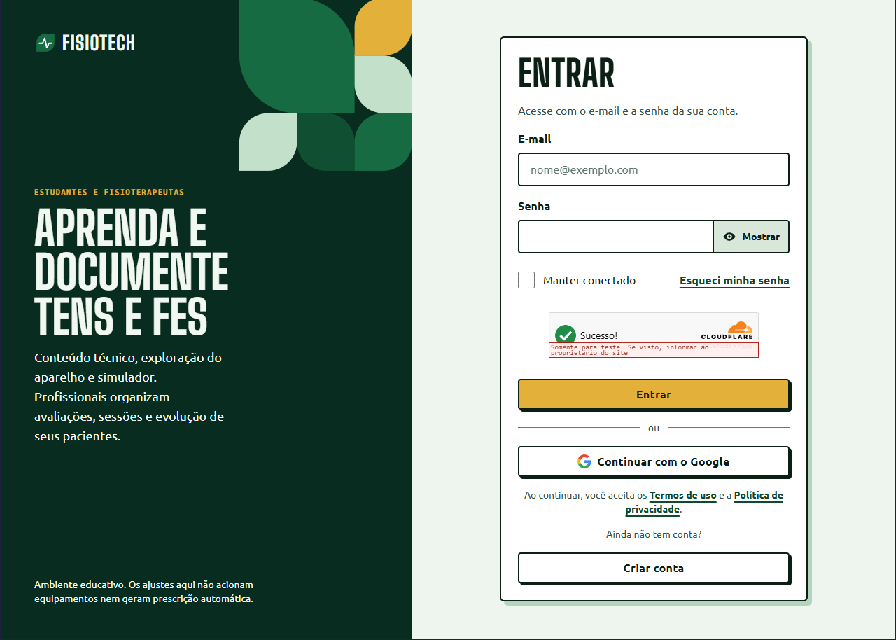

E-mail e senha com botão "Mostrar", "Manter conectado", "Esqueci minha senha", verificação de segurança (CAPTCHA), botão do Google e link para criar conta. *A tarja vermelha "Somente para teste" vem da chave de teste do Turnstile no ambiente local e não aparece em produção.*

### Criar conta, etapa 1 (`/cadastro`)

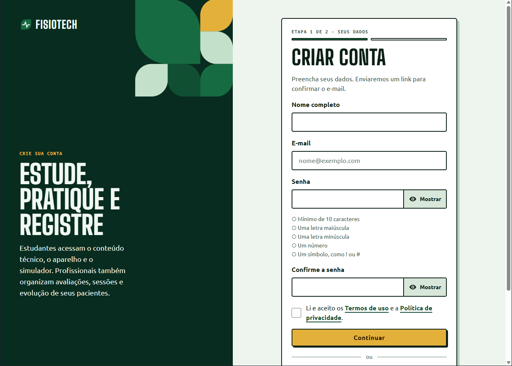

Nome, e-mail, senha com **checklist de requisitos em tempo real**, confirmação, aceite dos termos e botão "Continuar". Indicador "Etapa 1 de 2 · Seus dados". Abaixo, "ou" e o botão do Google.

### Verificação em duas etapas (`/mfa/verificar`)

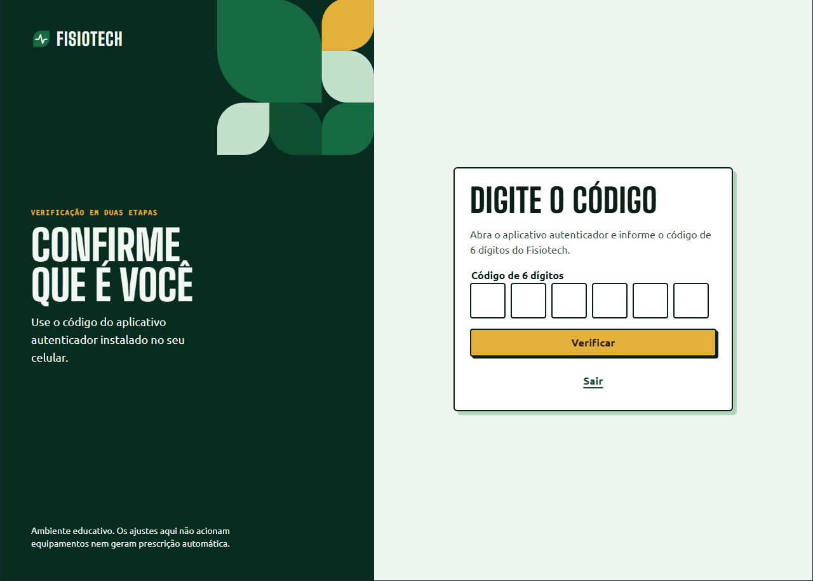

Código de 6 dígitos em caixas separadas, botão primário "Verificar" e "Sair". O mesmo padrão de caixas é usado ao ativar o autenticador e na nova senha.

### Tela inicial provisória (`/`)

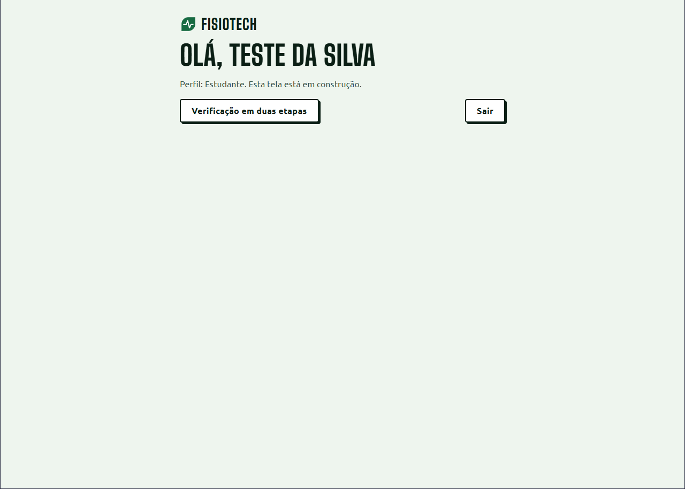

Provisória, "em construção". Mostra o nome do usuário em título, o perfil e as ações (verificação em duas etapas, sair). A tela inicial final segue o protótipo (seção 8).

### Termos de uso e Política de privacidade (`/termos`, `/privacidade`)

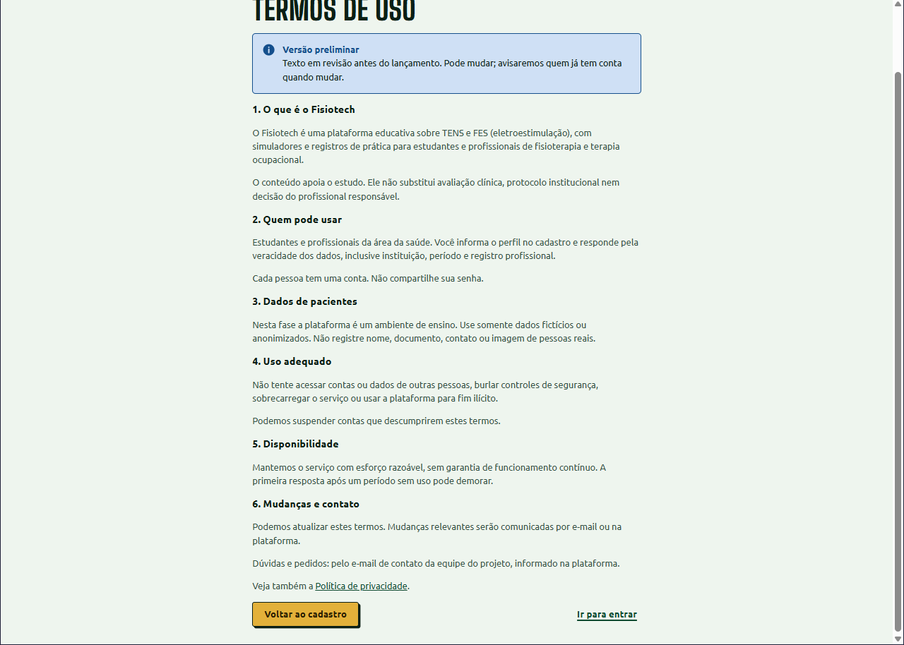

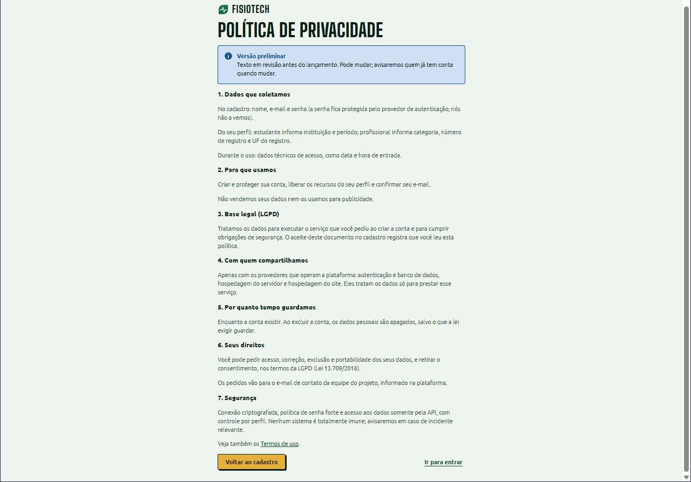

Documentos longos: título em caixa alta, alerta informativo "Versão preliminar", seções numeradas com subtítulo e parágrafos em coluna estreita, link para o outro documento e botões "Voltar ao cadastro" e "Ir para entrar". Os textos são preliminares, a revisar antes de usar dados reais.

---

## 8. Protótipo de referência

Imagens originais do protótipo, guardadas só como **referência de estilo**. Quando diferirem do app, vale o app (veja a tabela).

### Desktop

| | |
|---|---|
| 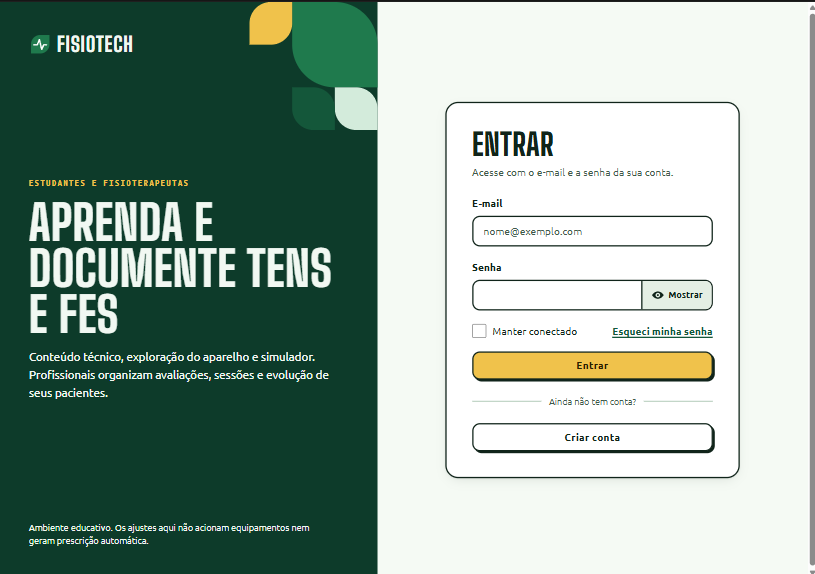 | 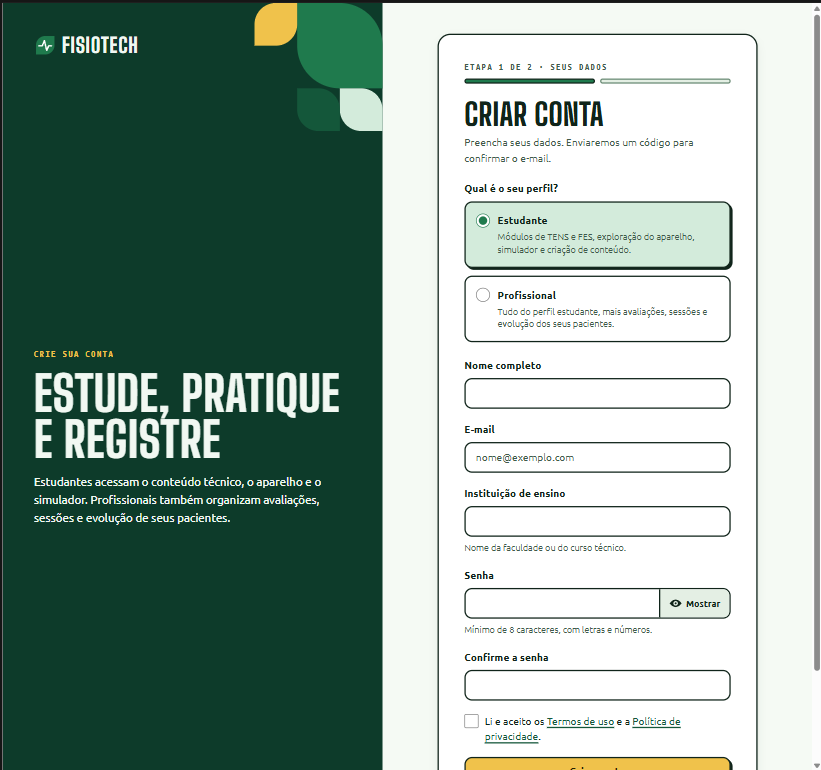 |
| Login | Cadastro (tela única) |
| 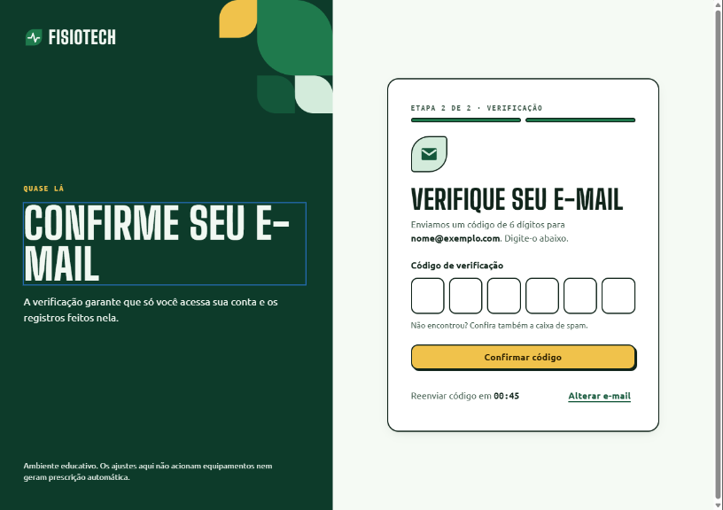 | 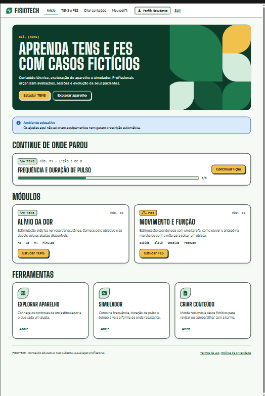 |
| Verificação de e-mail por código | Tela inicial: hero, aviso educativo, "Continue de onde parou", módulos e ferramentas |

### Mobile

| | | |
|---|---|---|
| 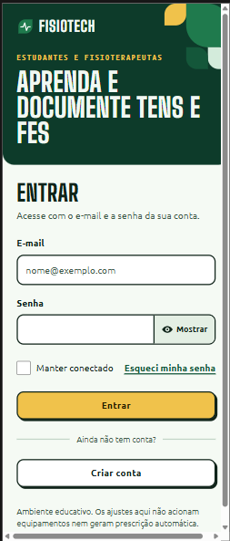 | 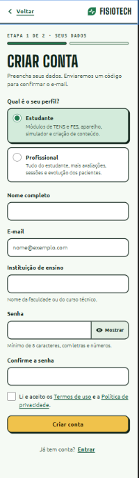 | 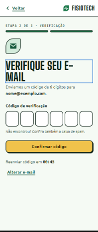 |
| Login | Cadastro | Verificação de e-mail |
| 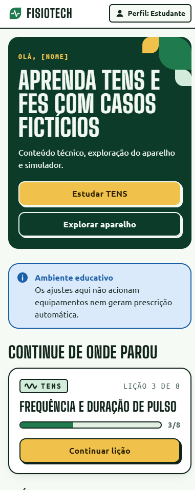 | 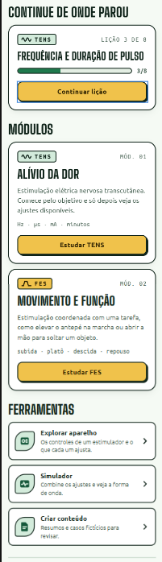 | 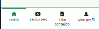 |
| Início (topo) | Início (módulos e ferramentas) | Barra de navegação inferior |

### O que o protótipo mostra e o app faz diferente

| Assunto | Protótipo | App (vale) |
|---|---|---|
| Confirmação de e-mail | Código de 6 dígitos digitado na tela | **Link** enviado por e-mail (decisão do projeto). As 6 caixas foram reaproveitadas na verificação em duas etapas e na nova senha |
| Cadastro | Uma tela só, perfil no topo | **Duas etapas**; o perfil é escolhido no início da etapa 2 |
| Senha | "Mínimo de 8 caracteres" | **10 caracteres**, maiúscula, minúscula, número e símbolo, com checklist em tempo real |
| Instituição (estudante) | Campo livre "Nome da faculdade ou do curso técnico" | Texto livre **com sugestões** (UniBH, PUC Minas, UFMG, Unifenas) |
| Login | Sem Google nem CAPTCHA | Com Google e CAPTCHA (Turnstile) |
| Aceite dos termos | Caixa simples | Exigido pela API, que grava versão e data |
| Cantos | Cartões mais arredondados nas imagens | Valem os tokens: 2, 4 e 6 px |
| Navegação no celular | Barra inferior com 4 abas (Início, TENS e FES, Criar conteúdo, Meu perfil) | A decidir quando a navegação for implementada. O componente "Navegação" do design system descreve abas no cabeçalho |

---

## 9. Acessibilidade

Meta: **WCAG 2.2 AA**. O design system já embute as regras; o app as segue e as testa.

- **Rótulo visível** em todo campo (`label` com `htmlFor`); placeholder nunca substitui o rótulo.
- **Erro ligado ao campo** (`aria-describedby` e `aria-invalid`), com ícone e a palavra "Erro", e anunciado ao aparecer (`role="alert"`). Nunca só cor.
- **Foco sempre visível**; ao trocar de etapa ou tela, o foco vai para o título, para o leitor de tela anunciar a novidade.
- **Informação nunca só por cor**: estado de requisito, tipo de alerta e botão indisponível têm forma ou texto próprio.
- **Alvos de toque** de no mínimo 44 px (campos com 48 px, caixas do código com 56 px).
- **Rolagem horizontal inexistente** e zoom do navegador respeitado.
- **Movimento reduzido** (`prefers-reduced-motion`).
- **Elementos decorativos** (folhas, ícones ao lado de texto) com `aria-hidden`.
- **Elementos de terceiros**, como o CAPTCHA, ficam em um grupo com legenda e têm o resultado anunciado.
- **Anúncios sem ruído**: o checklist da senha fala só quando o número de requisitos atendidos muda, não a cada tecla.

Como é verificado:

- `oxlint` com `jsx-a11y` no lint (`npm run lint`).
- `vitest-axe` nos testes de cada tela e componente (`npm test`): nenhum teste novo de tela deve ficar sem a verificação de acessibilidade.
- Contraste dos tokens calculado (seção 3.2).
- Teste manual com leitor de tela: Narrador do Windows no login e no cadastro. Vale repetir com NVDA, VoiceOver e TalkBack em cada fluxo novo; o teste automático cobre só parte dos problemas.

---

## 10. Como criar uma tela nova

1. **Leia** a seção 1 e confirme o que vale (código, depois este guia, depois o protótipo).
2. **Reaproveite** o que existe em `src/shared/ui`. Só crie componente novo se houver um segundo caso real.
3. **Use só tokens**: nada de cor, tamanho de fonte ou espaço escrito à mão. Se faltar um valor, proponha um token.
4. **Estilize com classes `tf-`** em `src/styles/ui.css`, mobile primeiro, e nomes em português.
5. **Texto**: siga a seção 2. Rótulo visível, erro junto ao campo, ação como verbo.
6. **Contraste**: confira qualquer par de cor novo (seção 3.2).
7. **Teclado e leitor de tela**: percorra a tela com `Tab` e confirme ordem, foco visível e nomes lidos.
8. **Teste** o comportamento e a acessibilidade (`vitest-axe`).
9. **Confira** `npm run lint`, `npm test` e `npm run build`.
10. **Capture a tela** e acrescente à seção 7 deste guia, se ela for um padrão novo.

Estrutura mínima de uma tela de autenticação:

```tsx
<AuthLayout voltarPara="/login" kicker="Recuperar acesso" titulo="Crie uma nova senha" texto="Escolha uma senha forte.">
  <div className="tf-pilha">
    <h1 className="tf-titulo">Nova senha</h1>
  </div>
  {/* Alerta, formulário e ações */}
</AuthLayout>
```

---

## 11. Armadilhas conhecidas

| Armadilha | Causa | Como evitar |
|---|---|---|
| Fontes não carregam em produção | A CSP não permite Google Fonts | Fontes auto-hospedadas via `@fontsource`; nunca `<link>` para fonte externa |
| Estilo inline barrado em produção | `style-src 'self'` na CSP | Use classes em `ui.css`; sem atributo `style` escrito à mão no HTML |
| Texto verde com contraste ruim | Uso de `brand` em texto | Texto verde é `brand-strong` |
| Foco invisível sobre o painel verde | O azul do foco reprova sobre `brand-deep` | Dentro de `.tf-on-deep` o foco passa a `accent` |
| Tela com rolagem horizontal no celular | Larguras fixas, imagem ou tabela larga | Mobile primeiro, `min-width: 0` em itens de flex e de grid, conferir a 320 px |
| Campo que o iOS amplia sozinho | Fonte menor que 16 px | Campos com 16 px ou mais |
| Título repetido no leitor de tela | O painel verde também tem título grande | O `h1` é só o do cartão; o título do painel é decorativo |
| Cópia dos tokens gerados do design system | O `tokens.css` de origem está desatualizado | Copie os valores do `src/styles/tokens.css` do app |
| Dois botões primários na mesma tela | Ação principal não definida | Um `primario` por contexto; o resto é `secundario` ou `ghost` |

Veja também: `../../README.md` (arquitetura, autenticação e testes) e `../../../SEGURANCA.md`.
